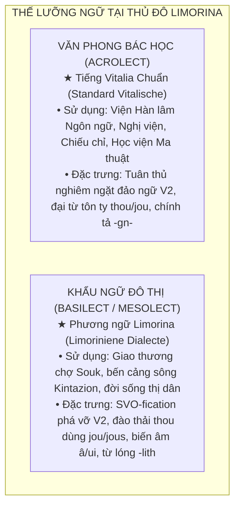

# Phương Ngữ Limorina Của Tiếng Vitalia (Limoriniene Vitalische)

Phương ngữ Limorina hiện đại là hậu duệ của phương ngữ Limorina cổ (dạng văn học trung kỳ ban đầu của khu vực thành phố Limorina) hình thành nên **tiếng Vitalia cận hiện đại**, bắt nguồn từ tiếng Vitalia trung đại. Sau đó, người dân thành phố tiếp nhận các đổi mới về âm thanh, hình thái và cú pháp, được các cơ quan học thuật thành phố Limorina chuẩn hóa thành phương ngữ hiện nay. Không nên đồng nhất trực tiếp phương ngữ Limorina hiện đại với tiếng Vitalia chuẩn ngày nay.

---

## 🌟 Tổng Quan Ngôn Ngữ
- **Tên tiếng Việt**: Phương ngữ Limorina
- **Tên tiếng Anh**: Limorinian dialect (Limorina region dialect) / Limorinian Vitalian
- **Nội danh (Endonym)**: *Limoriniene dialecte* / *Limoriniene Vitalische*
- **Nền tảng**: Middle English (thế kỷ 12–15), bảo lưu hệ thống nguyên âm trước Đại biến chuyển nguyên âm (Pre-Great Vowel Shift).
- **Cấu trúc từ vựng cốt lõi**: ~70% Gốc Germanic – ~30% Gốc Latinh/Romance, có tiếp nhận phụ tố văn hóa từ các bộ lạc du mục (Turkic).
- **Trật tự từ**: SVO cơ bản, hỗ trợ linh hoạt quy tắc đảo ngữ V2 khi thành phần trạng ngữ đứng đầu câu.

---

## 💎 Đặc Trưng Cốt Lõi Phân Biệt Với Tiếng Vitalia Chuẩn (Standard Vitalische) Và Tiếng Silicania
1. **Bảng chữ cái 27 ký tự**: Sử dụng thêm ký tự **Â / â** để biểu thị nguyên âm mở trước `/æ/` (*twâ*, *whât*, *mânie*).
2. **Nguyên âm khép trước tròn môi `/y/` (ký âm là `ui`)**: Xuất hiện có quy luật trong tầng từ vựng Romance / Anglo-Norman (~30%) khi nguyên âm tròn môi đi trước phụ âm răng hoặc vòm (*muintaine*, *duik*, *cuistume*), bắt nguồn từ lối phát âm đài các của giới quý tộc thủ đô.
3. **Hiện tượng tiêu biến phụ âm đầu *j-***: Phụ âm *j-* ở đầu từ thường câm hoặc không được phát âm rõ ràng (*jine* /ɪnə/).
4. **Quy tắc ký âm âm /nj/**: Không dùng tổ hợp *-gn-* như dạng chuẩn mà dùng **-ni-** hoặc **-nj-** (*renie*, *muintaine*).
5. **Số từ đặc thù**: Số đếm 2 là **twâ** (/twæː/), số thứ tự 2nd ưu tiên **seconde** (/səˈkɔn.də/).
6. **Hậu tố du mục thảo nguyên & Từ lóng đô thị**: Bảo lưu hậu tố danh từ tập hợp/trạng thái **-lith / -ilith** từ các bộ lạc du mục cổ, đồng thời được thị dân thủ đô lạm dụng sáng tạo thành các tiếng lóng đường phố (*druncklith*, *folcklith*, *churlelith*).
7. **Hệ thống tính từ đồng nhất với tiếng Vitalia chuẩn**: Tiếng Vitalia cận đại giữ dạng không đuôi theo hệ thống riêng, còn Silicania bảo tồn dạng yếu `-e`.
8. **SVO hóa trong khẩu ngữ**: Phương ngữ Limorina hiện đại ưu tiên SVO kể cả khi trạng ngữ đứng đầu (*Todai we have...*). V2 được giữ trong văn phong trang trọng/cổ và là quy tắc của tiếng Vitalia cận đại.
9. **Đại từ nhân xưng đô thị**: Đào thải đại từ *thou* (bị xem là quê mùa/nông thôn), phổ cập hóa **jou** cho toàn bộ ngôi 2 và kiến tạo dạng số nhiều đường phố riêng biệt (**jou-folck / jous**).

---

## 🏛️ Thế Lưỡng Ngữ Xã Hội (Sociolinguistic Diglossia) tại Kinh Đô Limorina

Một hiện tượng ngôn ngữ học then chốt giải thích sự khác biệt giữa Tiếng Vitalia Chuẩn và Phương ngữ Limorina chính là **thế lưỡng ngữ (Diglossia)** sâu sắc tại kinh đô:

* **Văn phong Bác học / Hành chính (Acrolect - High Variety)**: Dựa trên tầng văn học cổ điển của Limorina thế kỷ XI–XII. Đây là ngôn ngữ của luật pháp, kinh viện, ngoại giao và các bài diễn văn long trọng của triều đình và chính phủ Cộng hòa.
* **Khẩu ngữ Đô thị / Đời thường (Basilect / Mesolect - Low Variety)**: Nảy sinh từ nhịp sống giao thương hối hả, sự hòa huyết văn hóa tại các khu phố chợ vòm và các hội thợ thuyền. Thị dân ưa chuộng lối diễn đạt nhanh gọn, lược bỏ sự rườm rà của ngữ pháp cổ, tạo nên diện mạo phương ngữ Limorina hiện đại.

---

## 📊 Bảng Đối Chiếu Nhanh (Cheatsheet: Chuẩn vs. Limorina)

| Tiêu chí | Tiếng Vitalia Chuẩn (*Standard Vitalische*) | Phương ngữ Limorina (*Limoriniene Dialecte*) | Minh họa / Đối chiếu |
| :--- | :--- | :--- | :--- |
| **Bảng chữ cái** | 26 chữ cái Latinh tiêu chuẩn | **27 chữ cái** (thêm ký tự **Â / â**) | Chuẩn: *what, fat* → Limorina: *whât, fât* |
| **Phát âm /a/ ngắn** | Luôn đọc /a/ trước âm tắc/xát | **Biến thành /æ/ (`â`)** trước `-t, -k, -sch` | *that* (/ðat/) $\rightarrow$ **thât** (/ðæt/) |
| **Số từ 2 (two)** | **twoo** (/twoː/ - làm tròn môi) | **twâ** (/twæː/ - bẹt hóa từ *twā* Saxon cổ) | *twoo houses* vs. *twâ houses* |
| **Nguyên âm tròn môi /y/** | Hiếm; giữ nguyên âm Romance mượn | **Xuất hiện quy luật thành `ui` (/y/)** | *montaigne* $\rightarrow$ **muintaine**, *duke* $\rightarrow$ **duik** |
| **Ký âm âm mũi vòm /nj/** | Dùng tổ hợp **-gn-** | Tránh *-gn-*, dùng **-ni- / -nj-** | *regne* (/ˈrɛ.njə/) $\rightarrow$ **renje** (/ˈrɛ.njə/) |
| **Phụ âm đầu *j-*** | Phát âm rõ /j/ (*jine* /jiːnə/) | **Câm hoặc tiêu biến nhẹ** (*jine* /ɪnə/) | *jine dai* (một ngày) |
| **Quy tắc đảo ngữ V2** | **Bắt buộc** sau trạng ngữ đầu câu | **Bị phá vỡ trong khẩu ngữ**, giữ thuần SVO | Chuẩn: *Todai **looke we**...* Limorina: *Todai **we looke**...* |
| **Đại từ ngôi 2 (You)** | Phân biệt *thou* (thân mật) & *jou* (lịch sự) | **Đào thải *thou***; dùng độc nhất **jou** | Chuẩn: *Whidyr goos thou?* Limorina: *Whidyr goos jou?* |
| **Số nhiều ngôi 2** | Dùng *jou* hoặc *je* | Tạo từ đường phố: **jou-folck / jous** | *Gode dai to jou-folck!* (Chào cả lò chúng mày!) |
| **Biến đuôi tính từ** | Giữ dạng không đuôi chuẩn | **Hoàn toàn bất biến** trong mọi vị trí | *a good man*, *the good man*, *men are good* |
| **Hậu tố du mục `-lith`** | Dùng cho thuật ngữ thể chế (*vrielith*) | Phát triển thành **từ lóng sinh hoạt đường phố** | *druncklith* (tiệc say), *folcklith* (hội bạn thân) |
| **Biệt ngữ mỉa mai `-ese`** | Không phổ biến | Hậu tố châm biếm tác phong quan liêu | *courtese* (giọng cung đình), *clerkese* (giọng thư lại) |

---

1. [**Hệ thống Ngữ âm & Chính tả (Phonology & Orthography)**](phonology.md)
   - Bảng 27 chữ cái với ký tự đặc trưng `Â / â`.
   - Hệ thống nguyên âm, nguyên âm đôi và sự xuất hiện của âm `/y/` (**ui**).
   - Quy tắc phụ âm: *ch*, *-tch*, *sch*, *kn-*, *gn-*, giản lược *j-* đầu từ và âm /nj/ viết là *-ni-*.

2. [**Ngữ Pháp Phương Ngữ Limorina (Grammar)**](grammar.md)
   - Hệ thống chia động từ: Thì hiện tại (`-e`, `-es`), thì quá khứ yếu (`-ede` với các biến thể đồng hóa âm), quá khứ phân từ (`ge-` / `geh-`).
   - Danh động từ & phân từ hiện tại (`-inde`).
   - Trợ động từ (*haven*, *ben*, *schal*, *wille*).
   - Danh từ, mạo từ, bảng đại từ nhân xưng, tính từ bất biến và quy tắc đảo ngữ V2.

3. [**Từ Vựng & Quy Tắc Cấu Tạo Từ (Lexicon)**](lexicon.md)
   - Tỷ lệ cốt lõi ~70% Germanic và ~30% Latinh/Romance.
   - Các từ vựng địa phương đặc thù (*renje*, *knecht*, *dout*, *clerk*, *stelle*).
   - Các phụ tố cấu tạo từ: *-ische*, *-litche / -li*, *-hede*, *-dom*, và hậu tố du mục *-lith / -ilith*.
   - Kho tàng thành ngữ, tục ngữ đô thị và thuật ngữ học viện / ma thuật học Limorina.

4. [**Bảng 100 Từ Swadesh Phương Ngữ Limorina (Swadesh List)**](../../words_list/limorinian/swadesh_100_limorina.md)
   - 100 từ vựng căn bản của phương ngữ Limorina kèm phiên âm IPA chuẩn và từ nguyên.

5. [**Văn Bản Mẫu & Hội Thoại (Sample Texts)**](../../../samples/sample_texts.md)
   - Văn bản mẫu Tuyên ngôn vương quốc, đối thoại đời thường và khẩu ngữ phố cổ Limorina (*Limoriniene Strete-Speche*).
