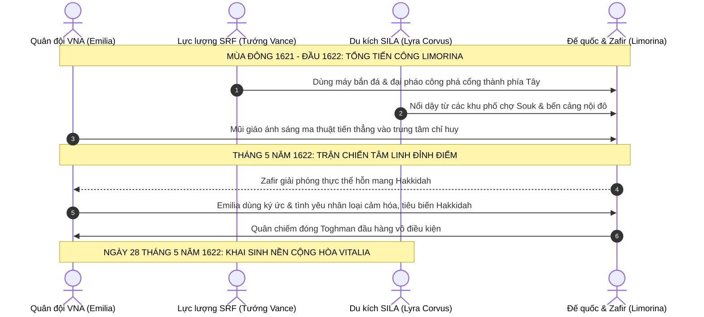

# Lịch sử Vitalia: Kỷ nguyên Đại Phục Quốc và Nền Cộng hòa Vitalia (1580 – 1622 AD)

> **Chuỗi tài liệu Bối cảnh Lịch sử Vitalia**:
> [Phần I: Cổ đại & Sơ kỳ Trung Cổ](./01-prior-to-middle-ages.md) · [Phần II: Hậu kỳ Morrazalina & Thịnh vượng chung (880 – 1029 AD)](./02-late-morrazalina-and-commonwealth.md) · [Phần III: Thời kỳ Đô hộ Toghmanistan (1029 – 1580 AD)](./03-toghmanist-rule-and-resistance.md) · **Phần IV: Đại Phục Quốc & Nền Cộng hòa (1580 – 1622 AD)**

Sau nhiều thế kỷ Toghman kiểm soát phần lớn Vitalia, giai đoạn 1580–1622 AD chứng kiến các làn sóng khởi nghĩa, sự liên kết giữa ba mặt trận kháng chiến và sự xuất hiện của nữ anh hùng mang dòng máu bất tử **Emilia Alexandrina Morrazalina** (*Emilia Snithere*). Giai đoạn này kết thúc bằng việc đánh bật chính quyền Toghman khỏi Vitalia và khai sinh **Nước Cộng hòa Vitalia** vào ngày 28 tháng 5 năm 1622.

---

## Quy ước chú thích

* **Ký hiệu `[]`**: Dẫn chiếu thông tin hoặc đối sánh bối cảnh lịch sử, triết học chính trị thế giới thực.
* **Ký hiệu `()`**: Chú thích tên bản địa, bí danh, chuyển tự tiếng Vitalia / tiếng Toghman hoặc niên đại.
* **Địa danh & Thực địa Trấn phủ**: Chuẩn hóa dựa trên hệ thống 15 địa hạt (*Counties*) theo bản đồ địa bạ và mạng lưới thành thị (*Burgs*).

---

## 1. Khúc Dạo Đầu: Các Cuộc Khởi Nghĩa Tiền Đề (1580 – 1613 AD)

Trước khi cuộc tổng khởi nghĩa của ba mặt trận bùng nổ vào thập niên 1610, sự suy tàn của Đế quốc Toghmanistan cùng hậu quả của trận đại dịch Cơn Sốt Đen (1542 – 1546 AD) đã tạo thời cơ cho các cuộc nổi dậy vũ trang đầu tiên bùng phát trên khắp các trấn phủ:

### 1.1. Cuộc Khởi nghĩa Thảo nguyên Miền Bắc tại Thornor & Silaltia (1584 – 1593 AD)
* **Bối cảnh thực địa**: Vùng đất cao nguyên phía Bắc gồm địa hạt **Thornor** (*Iqlīm Thurnūr*), **Chamliova** (*Wilāyat Çamliyūfa*) và nửa phía nam của địa hạt **Silaltia** (*Wilāyat Silālṭiya*) là nơi quân đồn trú Toghman mỏng nhất sau khi rút lui phòng ngự.
* **Diễn biến**: Một thủ lĩnh dân binh bản địa là **Kaelen Râu Đỏ** (*Kaelen se Rēada*) liên kết các phường thợ săn và tiễn thủ thảo nguyên, đồng loạt đánh úp 8 đơn vị thành thị (*Burgs*) tại Thornor. Nghĩa quân quét sạch các đồn binh thu thuế, thành lập vùng kiểm soát tự do kéo dài gần 10 năm.
* **Ý nghĩa**: Dù sau đó bị kỵ binh thiết giáp Shaddad từ Almaka kéo lên đàn áp đẫm máu vào năm 1593 AD, cuộc khởi nghĩa Thornor đã chứng minh quân chiếm đóng không còn đủ quân số để kiểm soát toàn bộ lãnh thổ.

### 1.2. Biến loạn Cảng Brampton & Vùng Duyên Hải Loutheton (1601 – 1606 AD)
* **Bối cảnh thực địa**: Địa hạt **Loutheton** và thương cảng duyên hải **Brampton** thuộc địa hạt **Feland** là hai yết hầu kinh tế hàng hải biển Bắc.
* **Diễn biến**: Bất bình trước "Sắc lệnh Thuế Thuyền bến" cưỡng đoạt 70% lợi nhuận thương mại để chi viện cho chiến tranh phương Nam, các bang hội thợ đóng tàu và dân chài Brampton liên minh với thị trấn cảng Loutheton và các tư sản thành phố Maclif (tiếng Vitalia cổ là *Maeclig*) đã phát động binh biến. Họ đánh chìm toàn bộ soái hạm của hạm đội tuần duyên Toghman, chiếm giữ ngọn hải đăng và pháo đài cửa biển suốt 5 năm.
* **Kết cục**: Cuộc phong tỏa đường biển buộc chính quyền Tổng trấn tại Limorina phải nhượng bộ một phần thuế khóa, tạo điều kiện cho các xưởng đóng tàu bí mật chế tạo thuyền chiến đáy bằng phục vụ kháng chiến sau này.

### 1.3. Cánh quân Lưu vong của Hector Hinderland (1608 – 1612 AD)
* **Xuất thân**: Tự xưng là hậu duệ trực hệ mang danh xưng của vị anh hùng lập quốc Hector Hinderland từ thời Thịnh vượng chung (1015 AD).
* **Hoạt động**: Tập hợp tàn dư các hiệp sĩ quý tộc lưu vong tại vùng rừng đồi phía Đông **Blandfordia** và địa hạt **Hatre**. Hector lãnh đạo một đội quân thiện chiến, nhiều lần phục kích gây thiệt hại nặng nề cho các đoàn xe áp tải vàng của Đế quốc, đánh chiếm sâu phía đông và làm chủ nửa phía bắc địa hạt Helythwia thuộc Trấn phủ Riralia (ngày nay thuộc tỉnh Nova Hibernia của CH Vitalia).
* **Hạn chế mang tính chí mạng**: Mang nặng tư tưởng quý tộc phong kiến hẹp hòi và tham vọng phục dựng ngai vàng dòng họ, Hector sẵn sàng dùng dân làng làm mồi nhử để đạt mục tiêu quân sự—chính sự tàn nhẫn này đã gieo mầm cho sự rạn nứt nội bộ và dẫn đến sự chia rẽ với Emilia sau này.

---

## 2. Ngọn Lửa Bùng Cháy: Sự Xuất Hiện của Emilia Snithere (1613 – 1618 AD)

### 2.1. Giấc Mơ và Vỡ Mộng tại Học viện Phép thuật Limorina (Năm 1613 AD)

#### Thân thế bí ẩn và những năm tháng ấu thơ
Emilia sinh vào mùa thu năm 1597 tại vùng thảo nguyên lộng gió Helenica. Khi cô vừa chào đời, người cha đã bặt vô âm tín, còn người mẹ thì được cho là đã qua đời sớm trong nghèo khó. Đứa trẻ côi cút mang trong mình dòng máu hoàng gia Morrazalina cổ xưa đã được Vương nữ bất tử **Elaina Morrazalina** đón nhận và nuôi dưỡng trong vòng tay bao bọc cách biệt tại thung lũng sương mù Armada. 

Lớn lên giữa sự tĩnh lặng của núi rừng, Emilia sớm bộc lộ một năng khiếu ma thuật kinh ngạc vượt xa người thường. Nhận thấy tài năng thiên bẩm và khát vọng hiểu biết của cô bé, quan Tổng trấn Helenica lúc bấy giờ là **Temujin Jalayir** (1569 – 1642)—một vị quan quý tộc gốc Toghman có tư tưởng cởi mở và thiện cảm sâu sắc với văn hóa bản địa—đã đứng ra bảo trợ pháp lý, cho phép cô rời thung lũng để theo học tại Học viện Phép thuật Đế quốc tọa lạc ngay tại trung tâm kinh đô Limorina.

#### Mầm mống lý tưởng và tình bạn tri kỷ
Năm 1613 AD, ở tuổi 16, Emilia là một trong những học viên xuất sắc và kín đáo nhất viện. Dưới vỏ bọc của một nữ sinh chăm chỉ và khiêm nhường, ngọn lửa uất hận trước cảnh đồng bào bị đọa đày luôn âm ỉ cháy trong lồng ngực cô. Emilia bí mật tham gia một hội kín nghiên cứu văn hóa và ngôn ngữ Vitalia cổ dưới sự che chở của giáo viên chủ nhiệm—Thượng cấp Pháp sư **Fatima Murwarid Al-Sayeed** (1566 – 1646, người phụ nữ gốc Toghmanistan có tấm lòng nhân ái, sau này được biết đến với tên bản địa là *Margarita Abigail Broun*). Chính tại nơi đây, lần đầu tiên Emilia được tiếp cận với các bản thảo lịch sử chưa bị bóp méo, thấu hiểu ngọn nguồn tự do và giá trị thiêng liêng của bản sắc dân tộc.

Cũng tại học viện, cô gặp gỡ **Gerald Robinson** (1590 – 1678), con trai của cựu Tổng trấn Limorina yêu nước Edmund Robinson. Dù không phải là một pháp sư sở hữu ma lực áp đảo, Gerald lại có nhãn quan chiến thuật sắc sảo, đầu óc tổ chức điềm tĩnh và một trái tim kiên định. Bị thuyết phục bởi lý tưởng cao đẹp của Emilia, anh luôn kề vai sát cánh, lo lắng cho sự dấn thân liều lĩnh của cô và dần trở thành điểm tựa tinh thần vững chắc nhất trong cuộc đời người nữ anh hùng.

#### Sắc lệnh Thuế Ngoại đạo và Cuộc đàn áp đẫm máu
Tháng 9 năm 1613 AD, bầu không khí ngột ngạt bao trùm khắp bờ cõi khi chính quyền thực dân Toghmanistan ban hành "Sắc lệnh Thuế Ngoại đạo" hà khắc, cưỡng đoạt tài sản của các gia đình thị dân bản địa và đe dọa đẩy hàng vạn người vào cảnh bần cùng. Giọt nước tràn ly khi gia đình một người bạn học nghèo của Emilia bị tịch thu toàn bộ gia sản, người cha già bị cùm chân giải đi lao dịch khổ sai nơi hầm mỏ Wantarii.

Không thể tiếp tục im lặng, vận dụng tài hùng biện thiên bẩm và kiến thức luật pháp Đế quốc, Emilia đã đứng lên hiệu triệu và tổ chức cuộc biểu tình ôn hòa quy mô lớn của học sinh, sinh viên và thị dân khắp Limorina và Amelia. Ban đầu, cuộc tuần hành diễn ra trật tự, thu hút sự hưởng ứng rộng rãi của công chúng và khiến triều đình Tổng trấn bối rối.

Tuy nhiên, bản chất của kẻ thống trị thực dân là bạo lực. Chính quyền Toghmanistan bí mật cài cắm những kẻ khiêu khích gây náo loạn, lấy cớ đó điều cấm quân thiết giáp ồ ạt kéo đến đàn áp dã man. Trước lưỡi đao tàn bạo đang bổ xuống những người bạn tay không tấc sắt, trong nỗ lực tuyệt vọng để cứu đồng bào khỏi thảm cảnh diệt sát, Emilia đã bộc phát năng lượng tiềm ẩn: cô thi triển **Huyết thuật (*Blōd Wiccecræft*)**—thứ ma thuật cổ xưa của đất Vitalia có uy lực kinh thiên động địa nhưng bị Đế quốc nghiêm cấm ngặt nghèo vì đòi hỏi sự tiêu hao sinh lực khủng khiếp. Luồng sóng xung kích ma thuật đỏ thẫm hất văng kỵ binh đàn áp, cứu thoát nhóm học viên trong gang tấc. Nhưng Huyết thuật đã để lại một dấu vết ma lực dị thường—thứ mà sau này Đại Pháp sư Zafir al-Mansur đã khai thác để ráo riết truy lùng cô.

Emilia lập tức bị trục xuất khỏi học viện với tội danh "phản loạn kích động bạo loạn" và bị phát lệnh truy nã gắt gao nhất trên toàn lãnh thổ. Nếm trải thất bại cay đắng đầu đời, cô gái trẻ nhận ra chân lý nghiệt ngã: *sự ôn hòa và luật pháp của kẻ cai trị không bao giờ có thể đem lại tự do cho một dân tộc đang chịu cảnh xiềng xích*.

---

### 2.2. Dưới Ngọn Cờ Hinderland và Sự Rạn Nứt Lý Tưởng (1614 – 1615 AD)

Chỉ sau một đêm trở thành tội phạm bị truy nã, Emilia phải trốn chạy khỏi Limorina nhờ sự trợ giúp của mạng lưới "tai mắt" bí mật do mẹ nuôi Elaina gây dựng. Ban đầu, cô nương náu tại tư dinh của quan Tổng trấn Vivilonia Ahmad Borjigin ở thành phố Axbriden (địa hạt Hatre). Nhận thấy mình không thể mãi trốn tránh, vào tháng Giêng năm 1614 AD, Emilia vượt đồi núi hiểm trở tìm đến căn cứ quân đoàn lưu vong của **Hector Hinderland** tại vùng rừng núi Blandfordia. Cô đặt niềm tin vào dòng dõi của vị Bảo Hộ Công từng lãnh đạo nền Thịnh vượng chung 600 năm trước như chiếc phao cứu sinh cuối cùng cho đại nghiệp cứu quốc.

Tại doanh trại nghĩa quân, dù được trọng dụng nhờ khả năng ma pháp chiến đấu xuất chúng, Emilia sớm trở thành cái gai trong mắt Hector. Trước sự thông tuệ và uy tín ngày một lớn của cô gái 17 tuổi, thói đố kỵ và tính hẹp hòi của Hector trỗi dậy. Ông ta tước bỏ vai trò tiền tuyến của Emilia, đẩy cô về làm công việc bàn giấy: ghi chép sổ sách hậu cần quân lương.

Thế nhưng, chính thử thách này lại làm rực sáng tài năng quản trị của cô. Trước năm 1614, toàn bộ sổ sách tài chính của nghĩa quân đều bị ghi chép hời hợt, thất thoát trầm trọng. Sau khi tiếp quản, Emilia chấn chỉnh toàn bộ hệ thống kho tàng, kiểm toán từng khoản chi tiêu, giúp nghĩa quân tiết kiệm được những khoản chiến phí khổng lồ để đúc vũ khí và tích trữ lương thảo. Không dừng lại ở đó, trước sự bế tắc của các chỉ huy tiền phương, Emilia đã chủ động vượt quyền, trực tiếp chỉ huy một phân đội cảm tử vượt qua đầm lầy chết chóc giữa căn cứ địa Stapseazion và pháo đài Letze (nay thuộc tỉnh Nova Hibernia), giải cứu thành công nhiều toán nghĩa binh bị quân Toghman bao vây cô lập.

Dẫu vậy, tham vọng phong kiến của Hector Hinderland là hố sâu không đáy. Mùa hè năm 1615 AD, Hector lên kế hoạch phục kích một đoàn xe áp tải vàng ròng của Đế quốc nhằm tìm kiếm một thắng lợi vang dội về kinh tế và thanh thế. Để đảm bảo thắng lợi, ông ta vạch ra một mưu mô tàn nhẫn: cố tình tung tin tình báo giả để dụ quân Toghman tràn vào cướp phá một ngôi làng nông dân vô tội gần đó làm mồi nhử nghi binh.

Khi kế hoạch tàn độc này đến tai Emilia, cô phẫn nộ tột cùng. Đối diện với Hector giữa đại bản doanh, cô dõng dạc cất lên tiếng nói lương tri làm chấn động toàn thể tướng sĩ:

> *"Mạng người không phải là những con tốt trên bàn cờ của ngài, thưa điện hạ!"*

Bất chấp lệnh cấm quân luật, Emilia đơn thương độc mã dẫn một phân đội nhỏ bí mật đột nhập vào làng trong đêm, kịp thời hướng dẫn toàn bộ hàng trăm thường dân vô tội sơ tán vào rừng sâu trước khi quân chiếm đóng ập tới. Dân làng được cứu sống trọn vẹn, nhưng kế hoạch phục kích của Hector bị bại lộ hoàn toàn. Trong cơn thịnh nộ điên cuồng vì mất mẻ vàng, Hector tước bỏ mọi danh phận và trục xuất Emilia khỏi hàng ngũ nghĩa quân.

---

### 2.3. Trở Về Armada và Thức Tỉnh Ma Thuật Sự Sống Của Cội Nguồn (1616 – 1618 AD)

Mùa đông năm 1616 AD, Emilia lầm lũi quay trở về thị trấn cổ Armada (địa hạt Helenica) trong tình trạng kiệt quệ về thể xác và vụn vỡ về tinh thần. Cảm giác bị ruồng bỏ và nỗi dằn vặt của một kẻ thất bại đè nặng lên tâm trí cô gái trẻ. Nhưng tại vùng đất thung lũng sương mù bất khả xâm phạm, Vương nữ bất tử **Elaina Morrazalina** đã dang rộng vòng tay đón nhận cô bằng tình mẫu tử thiêng liêng. Cùng với sự săn sóc dịu dàng của người chị hiền từ **Angelina Semyonovskaya** và tinh thần lạc quan trong trẻo của cô em họ **Limorina Archangeli-Morrazalina**, những vết thương lòng của Emilia từng bước được chữa lành.

Trong những tháng ngày tĩnh dưỡng, Elaina kiên nhẫn khai mở cho Emilia tri thức về **Ma thuật Sự Sống cổ xưa của Maperia**—loại ma thuật gắn liền máu thịt với linh mạch đất đai, hoa cỏ và hơi thở của muôn loài, đối lập hoàn toàn với thứ ma thuật công thức hủy diệt cứng nhắc của Đế quốc Toghmanistan. Elaina cũng hé lộ thiên cơ về người mẹ của mình—Nữ vương **Aglaea II** (tên khai sinh là **Illumia Morrazalina Dervisch**). Nhờ "Con Mắt Thần" (*The Divine Sight*), Nữ vương Illumia đã nhìn thấy trước thảm họa mất nước suốt nhiều thế kỷ và đã phong ấn một thánh vật cùng lời sấm truyền về một hậu duệ mang "Dấu ấn Ánh Trăng" sẽ xuất hiện để cứu chuộc giang sơn. Trong những đêm thiền định sâu dưới bầu trời Armada, Emilia luôn mơ thấy một vầng trăng bạc vô hình tĩnh lặng chiếu rọi tâm khảm mình.

Suốt hai năm (1617 – 1618 AD), Emilia cùng Elaina bôn tẩu khắp các nẻo đường Maperia. Bằng ma thuật sự sống, cô học cách lắng nghe tiếng thì thầm của đất mẹ, hồi sinh những dải đất đai cằn cỗi bị tàn phá vì khói lửa chiến tranh, thanh lọc các dòng suối ô nhiễm và che chở các bản làng hẻo lánh khỏi nanh vuốt của các toán tuần tiễu Toghman. Danh tiếng của một "pháp sư sự sống" mang trái tim bác ái bắt đầu lan tỏa như gió xuân khắp các địa hạt, biến cô từ một người tị nạn tuyệt vọng thành biểu tượng hy vọng mới của toàn cõi miền Nam.

---

### 2.4. Huyết Chiến Thành Armada và Sự Khai Sinh Biểu Tượng "Emilia Snithere" (1618 AD)

Sự hồi sinh mạnh mẽ của Maperia nhanh chóng kinh động đến bộ chỉ huy thực dân tại Limorina. Đầu năm 1618 AD, một đạo quân viễn chinh khét tiếng được phái đến nhằm san bằng pháo đài Armada và dập tắt ngọn lửa tự do. Kẻ thống lĩnh đạo quân này chính là quan tướng thực dân tàn bạo **Dimitri Saladin**. Cay đắng thay, Dimitri chính là người cha ruột năm xưa đã ruồng bỏ gia đình và đứa con thơ Emilia trong cảnh khốn cùng để chạy theo bổng lộc, tước vị của Đế quốc. Mang nặng mặc cảm tự ti của kẻ phản bội, hắn muốn chứng minh lòng trung thành với ngoại bang bằng sự tàn độc cùng cực: hắn ra lệnh thảm sát dã man toàn bộ cư dân ngoại vi Armada, thiêu rụi các khu xóm thợ để thị uy và muốn tự tay cắt đứt quá khứ nhục nhã của mình.

Trận chiến thành Armada vào tháng 5 năm 1618 AD không chỉ là một cuộc đối đầu quân sự, mà còn là cuộc thư hùng định mệnh giữa hai cha con, giữa ma thuật hủy diệt tàn bạo và ma thuật sự sống bất khuất. Trước cổng thành Armada, Dimitri tung ra bão lửa hủy diệt hòng thiêu rụi pháo lũy, nhưng Emilia lần đầu tiên vận dụng trọn vẹn sức mạnh linh mạch Maperia, dựng nên bức tường thành ánh sáng ngọc bích đẩy lùi mọi đòn tấn công. Bằng ma thuật sinh trưởng, cô điều khiển rễ cây ngàn năm tước bỏ vũ khí và đánh gục kẻ bạo chúa. Dẫu mang trong lòng vết thương sâu hoắm của một đứa con bị bỏ rơi, Emilia kiềm chế lưỡi gươm, không tự tay sát hại cha mình. Nhưng công lý đã được thực thi bởi chính lòng dân: những binh sĩ Vitalia bị cưỡng bức phục vụ trong hàng ngũ thực dân, sau khi chứng kiến sự cao thượng của Emilia và quá đỗi ghê tởm tội ác diệt chủng man rợ của Dimitri, đã đồng loạt nổi dậy trói chặt viên tướng phản bội và xử trảm hắn ngay tại quảng trường Armada.

Chiến thắng vang dội biến Emilia thành "Nữ thần Hộ mệnh của Armada". Để bước vào cuộc trường chinh giải phóng dân tộc và khước từ những tước vị quý tộc rỗng tuếch, cô quyết định chọn bí danh **Emilia Snithere** (bắt nguồn từ danh từ tác nhân Cổ ngữ *snīðere / snithere*, mang nghĩa "Thợ may"; các dị bản ngoại bang về sau ghi nhầm là *Schneider*). Cái tên mộc mạc ấy mang lời thề sắt son: *nguyện làm người thợ dùng sợi chỉ của lòng quả cảm và tình yêu thương để may vá, hàn gắn lại một Vitalia đã bị ngoại bang xé rách nát suốt gần sáu trăm năm*.

Vào ngày **28 tháng 5 năm 1618**, tại quảng trường ngập tràn cờ hoa của Armada, **Quân đội Quốc gia Vitalia (*Vitalia National Army - VNA*)** chính thức làm lễ tuyên thệ thành lập trên nền tảng Lực lượng Phòng vệ Maperia do Elaina lãnh đạo, suy tôn Emilia Snithere làm Tổng tư lệnh tối cao. Vượt qua hàng trăm dặm đường hiểm trở bị phong tỏa, **Gerald Robinson** là một trong những người đầu tiên tìm về đứng dưới ngọn cờ của cô, sẵn sàng cống hiến trọn vẹn tài năng chiến thuật cho ngày toàn thắng.

---

## 3. Ba Mặt Trận, Một Kẻ Thù & Thảm Họa Siêu Nhiên (1618 – 1621 AD)

Từ năm 1618 AD, cục diện kháng chiến trên vùng đất Vitalia được định hình bởi ba lực lượng độc lập trên ba mặt trận chiến lược:

### 3.1. Tiếng Vọng Khắp Giang Sơn: Cục Diện Ba Mặt Trận (1618 – 1620 AD)

Chiến công lẫy lừng của Emilia Snithere tại cửa ải Armada nhanh chóng vang dội khắp bốn phương, làm thức tỉnh các lực lượng kháng chiến độc lập đang âm ỉ hoạt động trên khắp lục địa:

1. **Phản ứng của Lực lượng Kháng chiến Soban (SRF) – Tướng Alistair Vance**:
   Tại pháo đài sơn cước Wantarii miền Tây, Tướng Alistair Vance—một quý tộc quân sự từng giữ hàm cao cấp trong quân đội Đế quốc trước khi đào ngũ vì không thể ngăn cản những cuộc thảm sát thường dân vô tội—nhận được báo cáo chiến sự. Mang nặng mặc cảm tội lỗi của một cựu sĩ quan thực dân, Vance vừa nể phục tư duy điều binh của Emilia, vừa hoài nghi sâu sắc về tính khả thi của một cuộc cách mạng "từ dưới lên", càng không tin vào những giai thoại "phép màu". Nhận thấy tiềm năng kiềm tỏa địch ở sườn Nam của VNA, ông cử sĩ quan liên lạc đến Armada thiết lập một thỏa ước phối hợp quân sự thận trọng, giữ khoảng cách để bảo toàn pháo lũy miền Tây.

2. **Phản ứng của Quân đội Giải phóng Silicania (SILA) – Lyra Corvus ("Nữ chăn cừu")**:
   Tại các cánh rừng rậm Vivilonia và đồng cỏ Silaltia, Lyra Corvus—người lãnh đạo xuất thân từ tầng lớp dân nghèo chăn cừu sở hữu sức lôi cuốn quần chúng phi thường—lại nhìn những câu chuyện thêu dệt về Emilia với con mắt cảnh giác của người lao động. Lo sợ Emilia chỉ là một quý tộc kiêu hãnh muốn mượn tay bần nông để khôi phục ngai vàng, Lyra cử người trinh sát lão luyện nhất của mình bí mật trà trộn vào hàng ngũ VNA để xác minh xem cô có thực sự là "người của nhân dân".

3. **Phương châm "Vừa đánh vừa xây" và Cuộc Phục hưng Văn hóa của VNA**:
   Điều khiến trinh sát của Lyra kinh ngạc và làm lay chuyển hoàn toàn định kiến của "Nữ chăn cừu" chính là cách VNA kiến thiết đời sống tại các vùng giải phóng. Dưới sự chỉ đạo của Emilia, các nghĩa sĩ VNA không đơn thuần đóng quân mà lập tức bắt tay vào phục hưng dân tộc: bãi bỏ toàn bộ chữ viết hành chính Toghman, mở lại các lớp học dạy tiếng Vitalia chuẩn mực, tổ chức các đêm hội diễn xướng dân ca cổ truyền và phục dựng các nghi lễ thờ cúng linh mạch đất mẹ bị ngoại bang cấm đoán suốt 500 năm. Cuộc kháng chiến của VNA đã chuyển hóa thành một phong trào phục hưng văn hóa vĩ đại, khơi dậy niềm tự hào dân tộc sâu sắc và khiến Lyra Corvus quyết định đặt trọn niềm tin vào Emilia.

---

### 3.2. Bóng Ma Tà Thần Hakkidah và Bí Mật của Kael Vordis

Giữa lúc chiến cuộc diễn ra giằng co trên ba mặt trận, một nhân vật đặc biệt xuất hiện tại tổng hành dinh VNA: **Kael Vordis**, một cựu "Thần Cảm Quan" (*Relic Seeker*) cao cấp của Đế quốc chuyên săn lùng cổ vật ma thuật. Kael đào ngũ vì phát hiện ra âm mưu đen tối của Đại Pháp sư Tối cao **Zafir al-Mansur**: trước nguy cơ thất trận, Zafir đã quyết định kích hoạt nghi lễ triệu hồi tà thần nguyên thủy **Hakkidah**—một thực thể hỗn mang đại diện cho sự tĩnh lặng băng giá của cái chết—nhằm xóa sổ toàn bộ sinh linh Vitalia thành tro bụi.

Kael cũng tiết lộ một góc khuất chấn động: động cơ của Zafir không chỉ xuất phát từ sự cuồng tín, mà từ mối thù hận cá nhân tột cùng. Hơn 40 năm trước, toàn bộ gia tộc của Zafir tại vùng biên ải đã bị sát hại dã man trong một cuộc bạo loạn đẫm máu của nông dân Vitalia cũ. Nỗi đau ấy biến Zafir thành một kẻ mang tâm lý phục thù bệnh hoạn: lão muốn dùng bạo lực áp đặt một "trật tự sắt đá vĩnh hằng" để tiêu diệt sự "hỗn loạn" mà lão căm ghét ở người Vitalia. Cuộc chiến vì thế không còn là cuộc đọ sức thông thường, mà trở thành sự va chạm giữa hai thế giới quan: một bên muốn dùng cái chết để trả thù cho sự hỗn loạn, một bên dùng tình yêu và sự sống để chuyển hóa hận thù.

Kael cũng là người đầu tiên kinh ngạc nhận ra: trong linh hồn của Emilia không chỉ có dấu vết ma thuật cổ, mà luôn được bao bọc bởi một quầng hào quang tĩnh lặng, dịu mát tựa như ánh trăng bạc ngàn năm.

---

### 3.3. Huyết Chiến Hẻm Núi Güneydere: Sự Hy Sinh Của Angelina và Dấu Ấn Ánh Trăng (1620 AD)

Mùa thu năm 1620 AD, VNA mở chiến dịch quy mô lớn đánh chiếm **Hẻm núi Güneydere** (địa hạt Almaka)—yết hầu hiểm trở nhất nhằm cắt đứt vĩnh viễn đường hành quân tiếp viện từ chính quốc Toghmanistan ở phương Nam. Nhận thấy nguy cơ bị cô lập hoàn toàn, Zafir đích thân xuất hiện trên vách núi Güneydere, kích hoạt nghi lễ triệu hồi một phần sức mạnh hủy diệt của Hakkidah, giáng xuống chiến trường một lời nguyền diệt vong đen đặc bao phủ cả thung lũng.

Đứng trước cái chết cận kề của hàng vạn nghĩa sĩ, người chị hiền hậu của Emilia—**Angelina Semyonovskaya**—đã bất ngờ lao ra tuyến đầu. Trong khoảnh khắc ngàn cân treo sợi tóc, Angelina bộc phát toàn bộ sinh lực tiềm ẩn, mở ra một vùng không gian kết giới nghịch đảo vô hiệu hóa hoàn toàn lời nguyền hắc ám. Nhưng cái giá phải trả là sự sống của chính cô: cơ thể Angelina tan biến thành ngàn hạt bụi sáng ngay trước mắt Emilia.

Trong nỗi đau tột cùng, Vương nữ Elaina quỳ bên Emilia và nấc nghẹn thú nhận sự thật được chôn giấu suốt hai thập kỷ: Angelina không phải là chị gái, mà chính là **người mẹ ruột** đã mang nặng đẻ đau sinh ra Emilia trong cô độc và tủi nhục, rồi tình nguyện hạ mình đóng vai một người chị hiền từ để âm thầm dõi theo, chăm sóc con gái suốt chuỗi ngày giông bão.

Nỗi đau đớn xé toạc tâm can đã phá vỡ phong ấn linh hồn cuối cùng: **Dấu ấn Ánh Trăng (*The Moon Mark*)**—thánh vật và di sản ngàn năm của Nữ vương Illumia (Aglaea II)—chính thức thức tỉnh trong huyết quản Emilia. Ánh trăng bạc bừng sáng chọc thủng màn đêm u tối của hẻm núi Güneydere.

Thừa hưởng dòng máu bất tử tối thượng của vương tộc Morrazalina, cơ thể Emilia ngừng lão hóa hoàn toàn, các vết thương lập tức khép miệng, cô không còn biết đến đói khát hay kiệt sức. Nhưng đi kèm với quyền năng thần thánh ấy là một nỗi kinh hoàng vô hình: xúc cảm phàm trần trong cô bắt đầu bị đông cứng lại; nỗi đau mất mẹ, niềm vui chiến thắng bỗng trở nên xa xăm, lạnh lẽo như bị ngăn cách bởi một tấm gương băng giá. Emilia đối mặt với khủng hoảng hiện sinh lớn nhất cuộc đời: nỗi sợ rằng sự bất tử sẽ biến cô thành một thực thể vô cảm xa lạ với đồng bào mình. Chính những giọt nước mắt ấm áp của Elaina và sự chở che kiên định của Gerald Robinson đã kéo cô trở lại với trái tim nhân loại.

---

### 3.4. Cơn Bão Siêu Nhiên và Hội Nghị Thống Nhất Tu Viện Vivilonia (1621 AD)

Đầu năm 1621 AD, sau khi bị Emilia vạch trần dã tâm và uy tín sụt giảm nghiêm trọng, Hector Hinderland ngày càng liều lĩnh và mù quáng. Trong nỗ lực tuyệt vọng nhằm chiếm lấy một chiến thắng lẫy lừng, đội quân của ông ta lọt vào bẫy phục kích của kỵ binh Shaddad và bị xóa sổ hoàn toàn; bản thân Hector tử trận trong cay đắng. Sự sụp đổ của phe Hinderland là hồi chuông cảnh tỉnh đanh thép: chủ nghĩa anh hùng cá nhân và tham vọng phong kiến đã hoàn toàn lỗi thời. Hàng ngàn tàn quân Hinderland tỉnh ngộ, lũ lượt kéo về gia nhập VNA.

Cùng lúc đó, các nghi lễ tà thuật của Zafir bắt đầu gây ra những biến dị kinh hoàng trên khắp lục địa: những cơn mưa axit thiêu rụi mùa màng, linh mạch đất đai bị hút cạn biến nhiều cánh đồng trù phú thành hoang mạc chết chóc. Cả ba lực lượng kháng chiến đều chịu tổn thất nặng nề. Đúng lúc nguy nan, một pháo đài tiền tiêu của SRF bất ngờ bị quân Toghman đánh chiếm do thông tin trinh sát sai lệch từ một nhóm du kích SILA, châm ngòi cho một cuộc khủng hoảng niềm tin dữ dội suýt bẻ gãy mọi nỗ lực liên minh.

Đứng trước nguy cơ dân tộc bị tiêu diệt từng bộ phận, Emilia đứng ra triệu tập Hội nghị Thống nhất lịch sử tại một tu viện cổ kính ở Vivilonia vào mùa xuân năm 1621 AD. Cuộc đàm phán trải qua ba vòng cân não gay cấn:
* *Vòng 1 (Xung đột quan điểm)*: Tướng Alistair Vance đập bàn yêu cầu thiết lập bộ chỉ huy quân sự tập quyền với kỷ luật thép kiểu quý tộc; ngược lại, Lyra Corvus kiên quyết đòi hỏi quyền tự quyết tuyệt đối và tự trị địa phương cho dân nghèo.
* *Vòng 2 (Tiếng chuông cảnh tỉnh)*: Kael Vordis bước ra, dùng ma pháp thị kiến tái hiện hình ảnh thảm họa diệt chủng mà thực thể Hakkidah sẽ giáng xuống nếu các phe còn chia rẽ. Cả tu viện lặng đi trong kinh hãi.
* *Vòng 3 (Đại đoàn kết vì đại cục)*: Emilia bước lên bục chủ trì. Không dùng uy quyền của một Đại Pháp sư bất tử, cô nói bằng sự chân thành xé ruột xé gan của một người con Vitalia. Cô đề xuất mô hình **Hội đồng Liên hiệp Kháng chiến**: chấp thuận trao quyền Tổng tư lệnh tác chiến chính quy cho Tướng Vance, đồng thời cam kết bằng danh dự trước Lyra Corvus về một bản Hiến pháp tương lai bảo đảm quyền tự trị địa phương và bình đẳng cho mọi tầng lớp bần nông. 

Sự bao dung, đức hy sinh và tầm nhìn kiệt xuất của Emilia đã làm tan chảy mọi định kiến. Ba bàn tay nắm chặt lấy nhau—lần đầu tiên sau hơn 5 thế kỷ chia cắt, toàn dân tộc Vitalia đứng chung dưới một ý chí sắt đá.

---

## 4. Đại Chiến Limorina & Khai Sinh Nền Cộng Hòa (1621 – 1622 AD)

### 4.1. Đêm Tối Của Tâm Hồn Trước Giờ Xuất Kích

Đêm trước ngày phát động chiến dịch tổng công kích Limorina, trong căn lều dã chiến ven bờ sông Kintazion, Emilia trải qua khoảnh khắc tăm tối nhất của đời mình. Gánh nặng sinh mệnh của hàng vạn đồng bào, nỗi đau mất mẹ chưa kịp nguôi ngoai, cùng sự xa cách lạnh lẽo mà lời nguyền bất tử mang lại khiến người con gái 24 tuổi sụp đổ trong đơn độc. Đứng trước gương, nhìn gương mặt trẻ mãi không già phản chiếu trong ánh nến leo lét, cô run rẩy tự hỏi liệu mình có đủ tư cách gánh vác vận mệnh của cả một dân tộc.

Chính trong giờ phút yếu lòng ấy, **Gerald Robinson** bước vào. Anh không quỳ lạy cô như vị thánh sống, cũng không nhìn cô với sự e sợ trước ma thuật bất tử. Gerald ngồi xuống bên cạnh, nhẹ nhàng nắm lấy bàn tay lạnh giá của cô và nói:

> *"Emilia, với mọi người ngoài kia, em là vị cứu tinh của Vitalia. Nhưng với anh, em mãi mãi là cô gái dũng cảm đã đứng lên bảo vệ bạn bè năm nào. Dù thế giới có đổi thay, dù thời gian có ngưng đọng trên thân thể em, anh vẫn sẽ luôn ở đây bên em."*

Sự thấu hiểu và tình yêu chân thành, kiên định vô điều kiện của Gerald đã kéo Emilia ra khỏi hố sâu băng giá, sưởi ấm lại trái tim con người trong cô. Khi bước ra khỏi căn lều trước bình minh, đôi mắt Emilia bừng sáng ngọn lửa quyết tâm kiên cường hơn bao giờ hết.

---

### 4.2. Đại Chiến Vây Hãm Kinh Đô Limorina (Cuối 1621 – Tháng 5/1622 AD)

Mùa đông năm 1621 AD, Chiến dịch giải phóng Limorina chính thức bùng nổ như một bản giao hưởng quân sự vĩ đại kết tinh từ ý chí của toàn thể dân tộc:
* **Mũi tiến công phía Tây của Tướng Vance**: Đạo quân chính quy SRF triển khai hàng trăm khẩu đại pháo và xe công thành, kiên cường dội bão lửa phá vỡ các pháo lũy kiên cố nhất của ngoại bang tại cửa ngõ phía Tây kinh thành.
* **Mũi nổi dậy nội đô của Lyra Corvus**: Hàng vạn chiến binh du kích SILA phối hợp cùng thị dân lao động đồng loạt nổi dậy từ các khu chợ *Souk*, cầu vòm đá và bến cảng sông Kintazion, cắt đứt hoàn toàn mạng lưới tiếp tế và thông tin liên lạc của quân chiếm đóng.
* **Mũi tiên phong của VNA**: Đạo quân VNA của Emilia, dưới sự dẫn đường của ngọn cờ rồng đỏ kiêu hãnh, tiến thẳng vào dinh thự đầu não của chính quyền thuộc địa như một mũi giáo ánh sáng xé toạc màn đêm nô lệ.

---

### 4.3. Cuộc Đối Đầu Trên Đỉnh Đài Thiên Văn và Phán Quyết Của Hakkidah (Tháng 5/1622 AD)

Bị dồn vào chân tường trong tuyệt vọng, Đại Pháp sư Zafir al-Mansur rút lên đỉnh đài thiên văn hoàng gia cổ tại Limorina. Trong cơn điên loạn cùng quẫn, lão hiến tế toàn bộ tà lực còn lại để giải phóng hoàn toàn thực thể **Hakkidah**—một cơn bão xoáy năng lượng đen ngòm nuốt chửng ánh sáng mặt trời, biến không khí thành giá lạnh chết chóc nhằm chôn vùi toàn bộ thành phố.

Đối diện với cơn bão hỗn mang, Emilia không dùng ma thuật hủy diệt để đáp trả bạo lực. Cô bay lên giữa tâm bão, kích hoạt Dấu ấn Ánh Trăng để che chở tâm trí và dùng chính sợi dây liên kết linh mạch của đất mẹ để kết nối tâm thức trực tiếp với thực thể thần linh. Thay vì xung đột quyền năng, cô truyền thẳng vào tâm thức Hakkidah những mảnh ký ức thiêng liêng nhất của loài người:
* *Nỗi đau đớn xé lòng nhưng chan chứa yêu thương của người mẹ Angelina khi sinh con trong cô độc;*
* *Lòng quả cảm phi thường của người lính vô danh lấy thân mình che chắn làn mưa tên cho đồng đội;*
* *Ánh mắt trìu mến và hơi ấm bàn tay của Gerald Robinson giữa đêm đông lạnh giá.*

Đứng trước sức mạnh sống động, mãnh liệt và thiêng liêng của tình người, thực thể Hakkidah—vốn chỉ quen với sự tĩnh lặng băng giá của cái chết—lần đầu tiên bị chấn động tận gốc rễ trước "trật tự sống động" của sự sống. Nhận ra thời đại của bóng tối đã khép lại, thực thể tà thần tự tiêu biến vào cõi hư vô, trả lại bầu trời trong xanh ngập tràn ánh nắng cho Limorina. Zafir gục ngã trong nỗi tuyệt vọng và bị bắt giữ; toàn bộ quân đồn trú Toghman buông gươm đầu hàng vô điều kiện. Năm trăm chín mươi ba năm đô hộ chính thức chấm dứt!

---

### 4.4. Ngày Độc Lập Lịch Sử: 28 Tháng 5 Năm 1622 AD

Ngày **28 tháng 5 năm 1622**, trước sự chứng kiến của hơn hai mươi vạn đồng bào tại Quảng trường Độc Lập thành phố Limorina, Emilia Snithere—chính thức tuyên bố danh xưng cội nguồn **Emilia Alexandrina Morrazalina**—đã long trọng đọc bản **Tuyên ngôn Độc lập**, khai sinh **Nước Cộng hòa Vitalia (*Republic of Vitalia*)**:

Trong tiếng hoan hô như sấm dậy rung chuyển đất trời, Emilia nhìn xuống biển người rực rỡ cờ hoa. Trong một khoảnh khắc kỳ diệu, cô nhìn thấy linh hồn mỉm cười của Angelina, của những người lính vô danh đã ngã xuống, và cả cái bóng lặng lẽ của cha mình Dimitri—một lời nhắc nhở thiêng liêng về cái giá máu xương của tự do và gánh nặng mà cô, với định mệnh bất tử, sẽ phải mang theo suốt chiều dài lịch sử.

Nhằm dung hòa nguyện vọng của các tầng lớp và ngăn chặn nguy cơ độc tài, một mô hình cộng hòa đại nghị tiến bộ được xác lập:
* **Emilia Alexandrina Morrazalina**: Đảm nhiệm cương vị **Thủ tướng Chính phủ (*Prime Minister*)**, chịu trách nhiệm hành pháp và tái thiết quốc gia.
* **Lyra Corvus**: Được bầu làm **Chủ tịch Hạ viện (*Speaker of the House of Commons*)**, đại diện cho tiếng nói quyền lợi của tầng lớp thường dân, nông dân và quyền tự trị địa phương.
* **Tướng Alistair Vance**: Đảm nhiệm cương vị **Bộ trưởng Chiến tranh (*Minister of War*)**, chỉ huy việc hợp nhất các lực lượng kháng chiến thành Quân đội Quốc gia chính quy thống nhất.

Ngay sau chiến thắng, một cuộc tranh luận nảy lửa nổ ra giữa Tướng Vance và Lyra Corvus về việc sáp nhập quân đội riêng vào lực lượng vũ trang quốc gia. Emilia đã kiên nhẫn đứng ra hòa giải, chứng minh rằng chiến thắng quân sự chỉ là khởi đầu, và cuộc đấu tranh xây dựng một quốc gia đoàn kết thực sự vẫn còn ở phía trước.

---

### 4.5. Vĩ Thanh: Cái Giá Của Sự Bất Tử

Vài năm sau ngày độc lập, đất nước dần hồi sinh từ tro tàn đổ nát. Đứng trên ban công Phủ Thủ tướng nhìn xuống dòng sông Kintazion êm đềm, Emilia nhìn thấy Gerald đang mỉm cười dạy học cho những đứa trẻ mồ côi sau cuộc chiến. Những người đồng đội năm xưa tóc đã bắt đầu điểm bạc, trong khi gương mặt cô vẫn trẻ trung vẹn nguyên như tuổi đôi mươi.

Gerald bước đến bên cô, khẽ nắm lấy bàn tay nhỏ nhắn. Anh là người duy nhất không bao giờ nhìn cô như một vị thánh bất tử xa vời, mà chỉ đơn giản là Emilia—người phụ nữ anh yêu trọn cả cuộc đời. Đám cưới giản dị của họ được tổ chức ấm cúng giữa những người bạn chí cốt, không kèn trống xa hoa. Đó không phải là một cái kết cổ tích khép lại, mà là sự khởi đầu của một hành trình vĩ đại và nhân văn: *hành trình học cách giữ trọn trái tim con người của một linh hồn bất tử*.

---

## 5. Bảng Niên Biểu Kỷ Nguyên Đại Phục Quốc (1580 – 1622 AD)

| Niên đại | Sự kiện then chốt | Nhân vật lịch sử | Ý nghĩa & Kết quả |
| :---: | :--- | :--- | :--- |
| **1584 – 1593 AD** | Khởi nghĩa vùng cao nguyên Thornor & Silaltia. | Kaelen Râu Đỏ | Cuộc nổi dậy quy mô lớn đầu tiên giải phóng miền Bắc trong gần 10 năm. |
| **1601 – 1606 AD** | Biến loạn Cảng Brampton & Vùng Duyên Hải Loutheton. | Các bang hội đóng tàu Brampton | Làm tê liệt hạm đội hải quân Toghman; đặt tiền đề đóng thuyền chiến kháng chiến. |
| **1608 – 1612 AD** | Cánh quân lưu vong của Hector Hinderland hoạt động tại Wantarii. | Hector Hinderland | Gây thiệt hại cho các đoàn xe vàng của địch; bộc lộ hạn chế của chủ nghĩa quân phiệt phong kiến. |
| **1613 AD** | Cuộc biểu tình sinh viên bùng nổ tại Học viện Phép thuật Limorina. | Emilia Morrazalina, Gerald Robinson | Emilia dùng Huyết thuật cứu bạn bè, bị trục xuất và bắt đầu con đường cứu quốc. |
| **1614 – 1615 AD** | Emilia gia nhập rồi chống lệnh Hector Hinderland để cứu dân làng. | Emilia, Hector Hinderland | Rạn nứt lý tưởng; khẳng định tôn chỉ "con người là trên hết" của Emilia. |
| **1616 – 1618 AD** | Emilia về Armada; học ma thuật sự sống từ Vương nữ Elaina; chém đầu Dimitri. | Emilia, Vương nữ Elaina, Dimitri Saladin | Khai sinh biểu tượng "Emilia Snithere"; lập Quân đội Quốc gia Vitalia (28/5/1618). |
| **1618 – 1620 AD** | Cục diện "Ba Mặt Trận, Một Kẻ Thù" (VNA – SRF – SILA). | Emilia, Tướng Vance, Lyra Corvus | Phối hợp tác chiến toàn diện; VNA đẩy mạnh phục hưng giáo dục và văn hóa bản địa. |
| **1620 AD** | Trận Hẻm núi Güneydere (Almaka); Angelina hy sinh; Dấu ấn Ánh Trăng thức tỉnh. | Angelina Semyonovskaya, Emilia | Emilia gánh nhận định mệnh bất tử; vượt qua khủng hoảng tâm hồn nhờ tình yêu của Gerald. |
| **1621 AD** | Quân Hinderland bị tiêu diệt; Hội nghị Thống nhất Tu viện Vivilonia. | Emilia, Vance, Lyra, Kael Vordis | Thành lập Hội đồng Liên hiệp Kháng chiến; thống nhất ý chí toàn dân tộc. |
| **Cuối 1621 – 5/1622** | Đại vây hãm Limorina; đánh bại Đại Pháp sư Zafir, cảm hóa Hakkidah. | Emilia, Zafir, liên quân kháng chiến | Giải phóng thủ đô Limorina, kết thúc quyền cai trị Toghman tại Vitalia sau 593 năm kể từ cuộc chinh phục năm 1029. |
| **28/5/1622 AD** | Tuyên ngôn Độc lập; Khai sinh Nước Cộng hòa Vitalia. | Emilia, Lyra Corvus, Alistair Vance | Chấm dứt kỷ nguyên đô hộ; mở ra thời kỳ hiện đại tự do, dân chủ và thịnh vượng. |

---

## 6. Nỗ lực chuẩn hoá tiếng Vitalia (*Vitalische*)

Ngày 28 tháng 5 năm 1622 không chỉ là ngày tái sinh về mặt chính trị, mà còn là mốc son chói lọi đánh dấu sự ra đời chính thức của **Tiếng Vitalia Chuẩn mực (*Vitalische*)** [được quy chuẩn trọn vẹn trong các tài liệu ngôn ngữ học của dự án]:

1. **Sắc lệnh Ngôn ngữ Độc lập (*Language Act of 1622*)**:
   * Thủ tướng Emilia Morrazalina ký sắc lệnh bãi bỏ vĩnh viễn việc sử dụng tiếng Toghman/Ả Rập trong các văn thư hành chính, tuyên bố tiếng Vitalia là **Quốc ngữ Duy nhất** của Nước Cộng hòa.
2. **Chuẩn hóa Ngữ pháp & Văn tự**:
   * Viện Hàn lâm Ngôn ngữ Limorina được tái lập tại thủ đô.
   * Lấy **tầng văn học cổ Limorina** làm chuẩn mực ngữ pháp: cố định trật tự câu SVO, quy chuẩn hệ thống động từ yếu với hậu tố quá khứ `-ede` (*lookede, makede*) và phân từ `ge- / geh-` (*gehaven, gewesen*).
   * Bảo lưu nguyên vẹn hệ thống nguyên âm German/Trung đại không trải qua biến chuyển nguyên âm (giữ nguyên *hous, mous, tiet*).
3. **Thanh lọc và Dung hòa Từ vựng**:
   * Loại bỏ nhiều từ mượn gắn với chính quyền quân quản Toghman, đồng thời phục dựng các từ gốc Vitalia Cổ được bảo tồn tại Armada qua nhiều thế kỷ.
   * Đồng thời, chấp nhận giữ lại các từ ngữ tiến bộ về kỹ nghệ thủy lợi (*noria*), thiên văn và thương mại hàng hải đã trở thành một phần tài sản văn hóa của nhân dân.

Tiếng Vitalia chính thức bước vào kỷ nguyên hiện đại rực rỡ, trở thành tiếng nói tự hào của một dân tộc kiên cường đã chiến thắng đêm dài nô lệ.

---

> ⏮️ **Tài liệu trước**: [**Phần III: Lịch sử Vitalia: Thời kỳ Đô hộ của Đế quốc Toghmanistan (1029 – 1580 AD)**](./03-toghmanist-rule-and-resistance.md) · 📖 **Tìm hiểu Ngôn ngữ**: [**Hệ thống Ngữ âm Tiếng Vitalia Chuẩn**](../../standard/phonology.md) · 🏠 **Trang chủ**: [**Cẩm nang Vitalische**](../../../)
