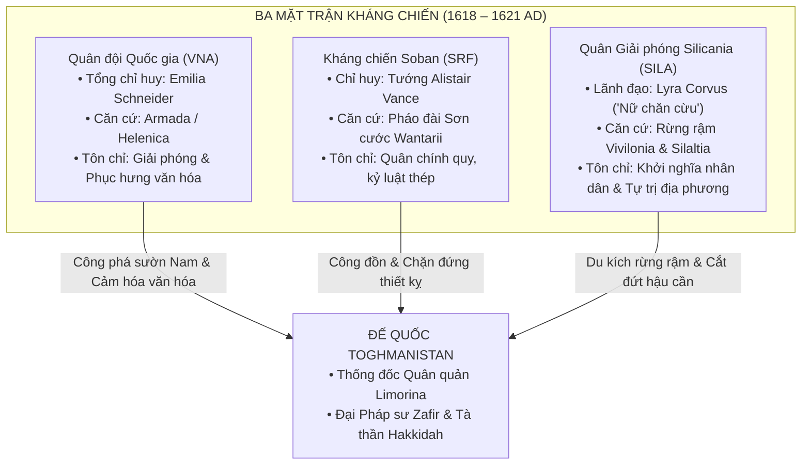
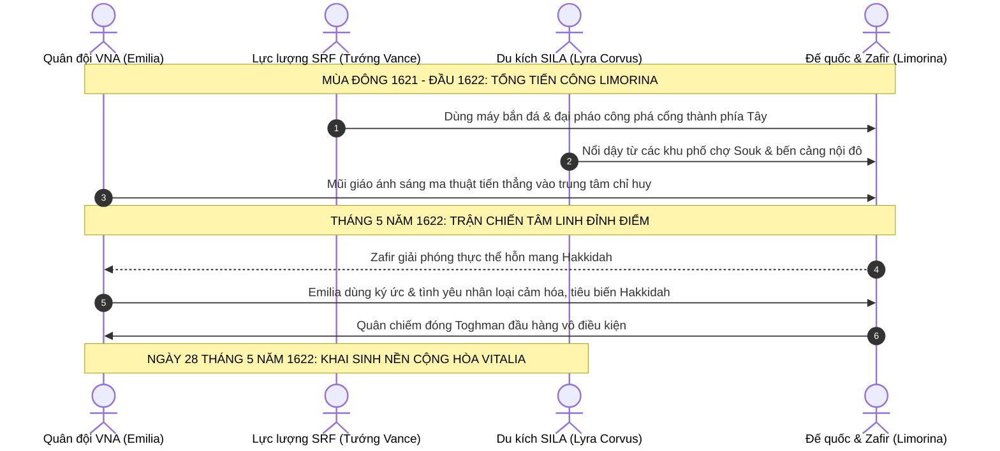

# Lịch sử Vitalia: Kỷ nguyên Đại Phục Quốc và Nền Cộng hòa Vitalia (1580 – 1622 AD)

> **Chuỗi tài liệu Bối cảnh Lịch sử Vitalia**:
> [Phần I: Cổ đại & Sơ kỳ Trung Cổ](./01-prior-to-middle-ages.md) · [Phần II: Hậu kỳ Morrazalina & Thịnh vượng chung (880 – 1029 AD)](./02-late-morrazalina-and-commonwealth.md) · [Phần III: Thời kỳ Đô hộ Toghmanistan (1029 – 1580 AD)](./03-toghmanist-rule-and-resistance.md) · **Phần IV: Đại Phục Quốc & Nền Cộng hòa (1580 – 1622 AD)**

Sau nhiều thế kỷ Toghman kiểm soát phần lớn Vitalia, giai đoạn 1580–1622 AD chứng kiến các làn sóng khởi nghĩa, sự liên kết giữa ba mặt trận kháng chiến và sự xuất hiện của nữ anh hùng mang dòng máu bất tử **Emilia Alexandrina Morrazalina** (*Emilia Schneider*). Giai đoạn này kết thúc bằng việc đánh bật chính quyền Toghman khỏi Vitalia và khai sinh **Nước Cộng hòa Vitalia** vào ngày 28 tháng 5 năm 1622.

---

## Quy ước chú thích

* **Ký hiệu `[]`**: Dẫn chiếu thông tin hoặc đối sánh bối cảnh lịch sử, triết học chính trị thế giới thực.
* **Ký hiệu `()`**: Chú thích tên bản địa, bí danh, chuyển tự tiếng Vitalia / tiếng Toghman hoặc niên đại.
* **Địa danh & Thực địa Trấn phủ**: Chuẩn hóa dựa trên hệ thống 15 châu hạt (*Counties*) theo bản đồ địa bạ và mạng lưới thành thị (*Burgs*).

---

## 1. Khúc Dạo Đầu: Các Cuộc Khởi Nghĩa Tiền Đề (1580 – 1613 AD)

Trước khi cuộc tổng khởi nghĩa của ba mặt trận bùng nổ vào thập niên 1610, sự suy tàn của Đế quốc Toghmanistan cùng hậu quả của trận đại dịch Cơn Sốt Đen (1542 – 1546 AD) đã tạo thời cơ cho các cuộc nổi dậy vũ trang đầu tiên bùng phát trên khắp các trấn phủ:

### 1. Cuộc Khởi nghĩa Thảo nguyên Miền Bắc tại Thornor & Silaltia (1584 – 1593 AD)
* **Bối cảnh thực địa**: Vùng đất cao nguyên phía Bắc gồm châu hạt **Thornor** (*Iqlīm Thurnūr*) và **Silaltia** (*Wilāyat Silālṭiya*) là nơi quân đồn trú Toghman mỏng nhất sau khi rút lui phòng ngự.
* **Diễn biến**: Một thủ lĩnh dân binh bản địa là **Kaelen Râu Đỏ** (*Kaelen se Rēada*) liên kết các phường thợ săn và tiễn thủ thảo nguyên, đồng loạt đánh úp 8 đơn vị thành thị (*Burgs*) tại Thornor. Nghĩa quân quét sạch các đồn binh thu thuế, thành lập vùng kiểm soát tự do kéo dài gần 10 năm.
* **Ý nghĩa**: Dù sau đó bị kỵ binh thiết giáp Shaddad từ Almaka kéo lên đàn áp đẫm máu vào năm 1593 AD, cuộc khởi nghĩa Thornor đã chứng minh quân chiếm đóng không còn đủ quân số để kiểm soát toàn bộ lãnh thổ.

### 2. Biến loạn Cảng Brampton & Vùng Duyên Hải Loutheton (1601 – 1606 AD)
* **Bối cảnh thực địa**: Châu hạt **Loutheton** và thương cảng duyên hải **Brampton**—yết hầu kinh tế hàng hải biển Bắc.
* **Diễn biến**: Bất bình trước "Sắc lệnh Thuế Thuyền bến" cưỡng đoạt 70% lợi nhuận thương mại để chi viện cho chiến tranh phương Nam, các bang hội thợ đóng tàu và dân chài Brampton đã phát động binh biến. Họ đánh chìm toàn bộ soái hạm của hạm đội tuần duyên Toghman, chiếm giữ ngọn hải đăng và pháo đài cửa biển suốt 5 năm.
* **Kết cục**: Cuộc phong tỏa đường biển buộc chính quyền Tổng trấn tại Limorina phải nhượng bộ một phần thuế khóa, tạo điều kiện cho các xưởng đóng tàu bí mật chế tạo thuyền chiến đáy bằng phục vụ kháng chiến sau này.

### 3. Cánh quân Lưu vong của Hector Hinderland (1608 – 1612 AD)
* **Xuất thân**: Là hậu duệ trực hệ mang danh xưng của vị anh hùng lập quốc Hector Hinderland từ thời Thịnh vượng chung (1015 AD).
* **Hoạt động**: Tập hợp tàn dư các hiệp sĩ quý tộc lưu vong tại vùng rừng đồi **Wantarii** và hạt **Hatre**. Hector lãnh đạo một đội quân thiện chiến, nhiều lần phục kích gây thiệt hại nặng nề cho các đoàn xe áp tải vàng của Đế quốc.
* **Hạn chế mang tính chí mạng**: Mang nặng tư tưởng quý tộc phong kiến hẹp hòi và tham vọng phục dựng ngai vàng dòng họ, Hector sẵn sàng dùng dân làng làm mồi nhử để đạt mục tiêu quân sự—chính sự tàn nhẫn này đã gieo mầm cho sự rạn nứt nội bộ và dẫn đến sự chia rẽ với Emilia sau này.

---

## 2. Ngọn Lửa Bùng Cháy: Sự Xuất Hiện của Emilia Schneider (1613 – 1618 AD)

### Biến cố Học viện Phép thuật Limorina (Năm 1613 AD)
* **Emilia Alexandrina Morrazalina**: Sinh ra năm 1597 tại Helenica, được Elaina Morrazalina nhận nuôi. Năm 1613 AD, cô gái 16 tuổi Emilia là một tài năng ma pháp hiếm có theo học tại Học viện Phép thuật Đế quốc đặt tại trung tâm thành phố Limorina. Bề ngoài là một học viên gương mẫu, nhưng bên trong cô bí mật tham gia nhóm nghiên cứu văn hóa Vitalia cổ, nung nấu khát vọng giải phóng dân tộc.
* **Gerald Robinson**: Người bạn đồng môn thân thiết, sở hữu tư duy chiến thuật sắc sảo và lòng trung thành kiên định, trở thành điểm tựa tinh thần vững chắc cho Emilia suốt cuộc đời.
* **Cuộc đàn áp đẫm máu**: Mùa thu năm 1613 AD, khi chính quyền Đế quốc ban hành "Sắc lệnh Thuế Ngoại đạo" bóp nghẹt các gia đình thị dân bản địa, Emilia đã dẫn đầu cuộc biểu tình ôn hòa của học viên. Chính quyền Toghman gài bẫy khiêu khích và điều cấm quân đàn áp dã man. Để cứu bạn bè khỏi mũi gươm đồ sát, Emilia bộc phát sử dụng **Huyết thuật (*Blood Magic*)**—thứ ma thuật cổ bị Đế quốc cấm ngặt. Cô bị trục xuất khỏi học viện và trở thành tội phạm truy nã gắt gao nhất của Đế quốc.

### Dưới ngọn cờ Hinderland và Sự Rạn nứt Lý tưởng (1614 – 1615 AD)
* Trốn thoát khỏi kinh thành, Emilia gia nhập quân đoàn lưu vong của Hector Hinderland tại vùng núi Wantarii. Khả năng ma pháp chiến đấu vượt trội của cô lập tức được trọng dụng.
* **Bước ngoặt lương tri (1615 AD)**: Hector lên kế hoạch phục kích một đoàn xe chở vàng lớn của Đế quốc bằng cách tung tin giả để quân Toghman tràn vào tàn sát một ngôi làng nông dân vô tội gần đó làm mồi nhử.
* Emilia kịch liệt phản đối: *"Mạng người không phải là những con tốt trên bàn cờ của ngài, thưa điện hạ!"*. Cô chống lệnh, một mình dẫn nhóm nhỏ bí mật sơ tán toàn bộ dân làng trước khi quân địch ập tới. Dân làng được cứu sống nhưng kế hoạch phục kích của Hector bị bại lộ. Trong cơn thịnh nộ, Hector trục xuất Emilia khỏi hàng ngũ.

### Trở về Armada & Thức Tỉnh Ma thuật Sự Sống (1616 – 1618 AD)
* **Thung lũng Maperia / Thành Armada (Châu hạt Helenica)**: Emilia trở về thị trấn cổ Armada trong tình trạng kiệt quệ và dằn vặt. Tại đây, cô được **Vương nữ bất tử Elaina Morrazalina** đón nhận với tình mẫu tử bao dung.
* **Di sản của Nữ vương Illumia (Aglaea II)**: Elaina truyền dạy cho cô loại **Ma thuật Sự Sống cổ xưa của Maperia**—thứ phép thuật gắn liền với linh mạch đất đai, chữa lành và tái sinh thiên nhiên, đối lập hoàn toàn với ma thuật hủy diệt cứng nhắc của Đế quốc. Elaina cũng hé lộ về di sản của mẫu thân mình—Nữ vương **Aglaea II** (tên khai sinh là **Illumia Morrazalina Dervisch**)—người từng sở hữu "Con Mắt Thần", nhìn thấy trước nhiều thế kỷ cai trị và xung đột với Toghman, đồng thời cất giấu thánh vật cùng lời sấm truyền về một hậu duệ mang "Dấu ấn Ánh Trăng" sẽ xuất hiện để giải phóng quê hương.
* **Trận huyết chiến bảo vệ Armada (1618 AD)**:
  * Viên quan tướng thực dân tàn bạo **Dimitri Saladin** (người cha đã ruồng bỏ Emilia trong quá khứ để theo đuổi danh vọng Đế quốc) thống lĩnh đạo quân viễn chinh tấn công pháo đài Armada.
  * Trong trận kịch chiến trước cửa ải Armada, Emilia lần đầu tiên vận dụng ma thuật sự sống đánh bại hoàn toàn ma thuật hủy diệt của Dimitri. Những binh lính Vitalia thuộc cấp quá ghê tởm tội ác của Dimitri đã bắt giữ và xử trảm hắn ngay tại quảng trường.
* **Bí danh "Emilia Schneider"**: Sau chiến thắng, Emilia lấy biệt danh **Schneider** (*Thợ may*), mang ý nghĩa nguyện làm người thợ dùng sợi chỉ của lòng quả cảm và tình thương để "may vá, hàn gắn lại một Vitalia đã bị ngoại bang xé rách nát".
* **Khai sinh Quân đội Quốc gia Vitalia (VNA)**: Ngày **28 tháng 5 năm 1618**, tại quảng trường Armada, **Quân đội Quốc gia Vitalia (*Vitalian National Army - VNA*)** chính thức được thành lập trên nền tảng Lực lượng Phòng vệ Maperia do Elaina lãnh đạo, suy tôn Emilia Schneider làm Tổng tư lệnh.

---

## 3. Ba Mặt Trận, Một Kẻ Thù & Thảm Họa Siêu Nhiên (1618 – 1621 AD)

Từ năm 1618 AD, cục diện kháng chiến trên lục địa Vitalia được định hình bởi ba lực lượng độc lập trên ba mặt trận chiến lược:

### Đặc trưng của Ba Ngọn Cờ:
1. **VNA (Emilia Schneider)**: Vừa đánh giặc vừa xây dựng đời sống mới. Tại các vùng giải phóng, VNA không chỉ lập chính quyền nhân dân mà còn mở lại các lớp dạy tiếng Vitalia chuẩn, phục dựng các nghi lễ ma thuật sự sống bản địa, biến phong trào thành cuộc **Phục hưng Văn hóa Dân tộc**.
2. **SRF (Tướng Alistair Vance)**: Alistair Vance là một viên tướng quý tộc Vitalia từng phục vụ trong quân đội Đế quốc; sau khi chứng kiến các vụ thảm sát thường dân vô tội, ông đào ngũ và lập ra Mặt trận Soban. Với kỷ luật quân sự chính quy, SRF biến các pháo đài vùng núi Wantarii thành bức tường thép bẻ gãy mọi mũi xung kích của thiết kỵ Toghman.
3. **SILA (Lyra Corvus - "Nữ chăn cừu")**: Xuất thân từ tầng lớp dân nghèo chăn cừu vùng đồng cỏ Silicania, Lyra sở hữu tài năng hiệu triệu quần chúng phi thường. SILA sử dụng chiến thuật du kích thoắt ẩn thoắt hiện trong các khu rừng già Vivilonia, tiêu hao sinh lực địch.

### Âm mưu của Zafir và Lời nguyền Tà thần Hakkidah (1620 AD)
* Đứng trước nguy cơ thất thủ, Đại Pháp sư Đế quốc **Zafir al-Mansur**—một kẻ mang lòng căm thù mù quáng với Vitalia—quyết định kích hoạt tà thuật cổ nhằm đánh thức thực thể hỗn mang mang tên **Hakkidah** để biến toàn bộ sinh linh Vitalia thành tro bụi.
* **Trận chiến Hẻm núi Güneydere (1620 AD)**:
  * Trong một chiến dịch quy mô lớn của VNA nhằm đánh chiếm cửa ngõ yết hầu Güneydere (châu hạt Almaka) để chặn đứng đường tiếp viện từ phương Nam, Zafir tung ra lời nguyền hủy diệt diện rộng.
  * Người chị gái (cũng là mẹ ruột) của Emilia, **Angelina Semyonovskaya**, đã dũng cảm lao ra, bộc phát toàn bộ sinh lực để tạo vùng không gian bảo hộ vô hiệu hóa lời nguyền, rồi hy sinh.
  * **Cái giá của sự Bất tử**: Nỗi đau tột cùng kích hoạt **Dấu ấn Ánh Trăng (*The Moon Mark*)** trong huyết quản Emilia. Thể xác cô ngừng lão hóa, không còn biết đói hay mỏi mệt, nhưng phải đối mặt với nỗi sợ hãi tột cùng rằng sự bất tử sẽ làm tâm hồn cô dần trở nên băng giá, xa cách với nhân loại. Nhờ tình yêu ấm áp của Elaina và những người khác, Emilia đã giữ vững được trái tim con người của mình.

### Sự Sụp đổ của Hinderland & Hội nghị Thống nhất Vivilonia (1621 AD)
* Đầu năm 1621 AD, do sự kiêu ngạo và liều lĩnh, đội quân của Hector Hinderland bị rơi vào bẫy phục kích của quân Toghman và bị xóa sổ hoàn toàn; bản thân Hector tử trận. Tàn quân Hinderland tỉnh ngộ, tìm về gia nhập VNA.
* **Hội nghị Tu viện Vivilonia (Mùa xuân 1621 AD)**:
  * Trước thảm họa diệt vong từ tà thuật của Zafir, Emilia đứng ra triệu tập Hội nghị Thống nhất lịch sử giữa ba lực lượng tại tu viện cổ Vivilonia.
  * Bằng lòng chân thành và tầm nhìn chính trị bao dung, Emilia hòa giải thành công mâu thuẫn gay gắt giữa Tướng Vance (đòi hỏi kỷ luật quân quản) và Lyra Corvus (đòi hỏi tự trị địa phương).
  * **Thành lập Hội đồng Liên hiệp Kháng chiến Vitalia**: Ba lực lượng hợp nhất chỉ huy, chuẩn bị cho cuộc tổng tấn công quyết định vào sào huyệt cuối cùng của ngoại bang tại Kinh thành Limorina.

---

## 4. Đại Chiến Limorina & Khai Sinh Nền Cộng Hòa (1621 – 1622 AD)

### Cuộc Vây hãm Kinh đô Limorina (Cuối 1621 – Tháng 5/1622 AD)
* Chiến dịch giải phóng Limorina diễn ra như một bản giao hưởng quân sự vĩ đại:
  * Cánh quân thiết huyết của Tướng Vance công phá tan tành các bức tường thành kiên cố phía Tây.
  * Các chiến binh du kích của Lyra Corvus đồng loạt nổi dậy từ các khu chợ *Souk* và các con ngõ ngách nội đô.
  * Đạo quân VNA của Emilia, dưới sự dẫn đường của ngọn cờ rồng đỏ, tiến thẳng vào dinh thự đầu não của chính quyền thuộc địa.

### Cuộc Đối Đầu với Zafir và Phán Quyết của Thần Linh (Tháng 5/1622 AD)
* Trên đỉnh đài thiên văn Limorina, Zafir tung ra toàn bộ tà lực giải phóng thực thể **Hakkidah**—một cơn bão năng lượng hỗn loạn nuốt chửng mọi sự sống.
* Thay vì sử dụng ma thuật hủy diệt để đáp trả bạo lực, Emilia dùng Dấu ấn Ánh Trăng che chắn tâm trí và truyền thẳng vào tâm thức của vị thần những mảnh ký ức thiêng liêng nhất của nhân loại:
  * *Nỗi đau xé lòng và đức hy sinh của người mẹ Angelina;*
  * *Lòng quả cảm quên mình của những người lính vô danh ngã xuống vì tự do;*
  * *Tình yêu chân thành, ấm áp và kiên định của Gerald Robinson.*
* Đứng trước sức mạnh sống động và vẻ đẹp thiêng liêng của tình người, thực thể tà thần vốn chỉ biết đến trật tự băng giá của cái chết đã bị lay chuyển tận gốc rễ và tự tan biến vào hư không. Zafir suy sụp và bị bắt giữ; toàn bộ quân đồn trú Toghman buông vũ khí đầu hàng vô điều kiện.

### Ngày Độc Lập Lịch Sử: 28 Tháng 5 Năm 1622 AD
Ngày **28 tháng 5 năm 1622**, trước sự chứng kiến của hơn hai mươi vạn đồng bào tại Quảng trường Độc Lập thành phố Limorina, Emilia Schneider—chính thức tuyên bố danh xưng cội nguồn **Emilia Alexandrina Morrazalina**—đã long trọng đọc bản **Tuyên ngôn Độc lập**, khai sinh **Nước Cộng hòa Vitalia (*Republic of Vitalia*)**:

* **Thể chế Tam Quyền Phân Lập**: Nhằm dung hòa nguyện vọng của các tầng lớp và ngăn chặn nguy cơ độc tài, một mô hình cộng hòa đại nghị tiến bộ được xác lập:
  * **Emilia Alexandrina Morrazalina**: Đảm nhiệm cương vị **Thủ tướng Chính phủ (*Prime Minister*)**, chịu trách nhiệm hành pháp và tái thiết quốc gia.
  * **Lyra Corvus**: Được bầu làm **Chủ tịch Hạ viện (*Speaker of the House of Commons*)**, đại diện cho tiếng nói quyền lợi của tầng lớp thường dân, nông dân và quyền tự trị địa phương.
  * **Tướng Alistair Vance**: Đảm nhiệm cương vị **Bộ trưởng Chiến tranh (*Minister of War*)**, chỉ huy việc hợp nhất các lực lượng kháng chiến thành Quân đội Quốc gia chính quy thống nhất.

---

## 5. Bảng Niên Biểu Kỷ Nguyên Đại Phục Quốc (1580 – 1622 AD)

| Niên đại | Sự kiện then chốt | Nhân vật lịch sử | Ý nghĩa & Kết quả |
| :---: | :--- | :--- | :--- |
| **1584 – 1593 AD** | Khởi nghĩa vùng cao nguyên Thornor & Silaltia. | Kaelen Râu Đỏ | Cuộc nổi dậy quy mô lớn đầu tiên giải phóng miền Bắc trong gần 10 năm. |
| **1601 – 1606 AD** | Biến loạn Cảng Brampton & Vùng Duyên Hải Loutheton. | Các bang hội đóng tàu Brampton | Làm tê liệt hạm đội hải quân Toghman; đặt tiền đề đóng thuyền chiến kháng chiến. |
| **1608 – 1612 AD** | Cánh quân lưu vong của Hector Hinderland hoạt động tại Wantarii. | Hector Hinderland | Gây thiệt hại cho các đoàn xe vàng của địch; bộc lộ hạn chế của chủ nghĩa quân phiệt phong kiến. |
| **1613 AD** | Cuộc biểu tình sinh viên bùng nổ tại Học viện Phép thuật Limorina. | Emilia Morrazalina, Gerald Robinson | Emilia dùng Huyết thuật cứu bạn bè, bị trục xuất và bắt đầu con đường cứu quốc. |
| **1614 – 1615 AD** | Emilia gia nhập rồi chống lệnh Hector Hinderland để cứu dân làng. | Emilia, Hector Hinderland | Rạn nứt lý tưởng; khẳng định tôn chỉ "con người là trên hết" của Emilia. |
| **1616 – 1618 AD** | Emilia về Armada; học ma thuật sự sống từ Vương nữ Elaina; chém đầu Dimitri. | Emilia, Vương nữ Elaina, Dimitri Saladin | Khai sinh biểu tượng "Emilia Schneider"; lập Quân đội Quốc gia Vitalia (28/5/1618). |
| **1618 – 1620 AD** | Cục diện "Ba Mặt Trận, Một Kẻ Thù" (VNA – SRF – SILA). | Emilia, Tướng Vance, Lyra Corvus | Phối hợp tác chiến toàn diện; VNA đẩy mạnh phục hưng giáo dục và văn hóa bản địa. |
| **1620 AD** | Trận Hẻm núi Güneydere (Almaka); Angelina hy sinh; Dấu ấn Ánh Trăng thức tỉnh. | Angelina Semyonovskaya, Emilia | Emilia gánh nhận định mệnh bất tử; vượt qua khủng hoảng tâm hồn nhờ tình yêu của Gerald. |
| **1621 AD** | Quân Hinderland bị tiêu diệt; Hội nghị Thống nhất Tu viện Vivilonia. | Emilia, Vance, Lyra, Kael Vordis | Thành lập Hội đồng Liên hiệp Kháng chiến; thống nhất ý chí toàn dân tộc. |
| **Cuối 1621 – 5/1622** | Đại vây hãm Limorina; đánh bại Đại Pháp sư Zafir, cảm hóa Hakkidah. | Emilia, Zafir, liên quân kháng chiến | Giải phóng thủ đô Limorina, kết thúc quyền cai trị Toghman tại Vitalia sau 593 năm kể từ cuộc chinh phục năm 1029. |
| **28/5/1622 AD** | Tuyên ngôn Độc lập; Khai sinh Nước Cộng hòa Vitalia. | Emilia, Lyra Corvus, Alistair Vance | Chấm dứt kỷ nguyên đô hộ; mở ra thời kỳ hiện đại tự do, dân chủ và thịnh vượng. |

---

## 6. Khai Sinh Quốc Ngữ: Sự Chuẩn Hóa của Tiếng Vitalia Hiện Đại (*Vitalische*)

Ngày 28 tháng 5 năm 1622 không chỉ là ngày tái sinh về mặt chính trị, mà còn là mốc son chói lọi đánh dấu sự ra đời chính thức của **Tiếng Vitalia Chuẩn mực (*Vitalische*)** [được quy chuẩn trọn vẹn trong các tài liệu ngôn ngữ học của dự án]:

1. **Sắc lệnh Ngôn ngữ Độc lập (*Language Act of 1622*)**:
   * Thủ tướng Emilia Morrazalina ký sắc lệnh bãi bỏ vĩnh viễn việc sử dụng tiếng Toghman/Ả Rập trong các văn thư hành chính, tuyên bố tiếng Vitalia là **Quốc ngữ Duy nhất** của Nước Cộng hòa.
2. **Chuẩn hóa Ngữ pháp & Văn tự**:
   * Viện Hàn lâm Ngôn ngữ Limorina được tái lập tại thủ đô.
   * Lấy **tầng văn học cổ Limorina** làm chuẩn mực ngữ pháp: cố định trật tự câu SVO, quy chuẩn hệ thống động từ yếu với hậu tố quá khứ `-ede` (*lookede, makede*) và phân từ `ge- / geh-` (*gehaven, gewesen*).
   * Bảo lưu nguyên vẹn hệ thống nguyên âm German/Trung đại không trải qua biến chuyển nguyên âm (giữ nguyên *hous, mous, tiet*).
3. **Thanh lọc và Dung hòa Từ vựng**:
   * Loại bỏ nhiều từ mượn gắn với chính quyền quân quản Toghman, đồng thời phục dựng các từ gốc Vitalia Cổ được bảo tồn tại Armada qua nhiều thế kỷ.
   * Đồng thời, chấp nhận giữ lại các từ ngữ tiến bộ về kỹ nghệ thủy lợi (*noria*), thiên văn và thương mại hàng hải đã trở thành một phần tài sản văn hóa của nhân dân.

Tiếng Vitalia chính thức bước vào kỷ nguyên hiện đại rực rỡ, trở thành tiếng nói tự hào của một dân tộc kiên cường đã chiến thắng đêm dài nô lệ.

---

> ⏮️ **Tài liệu trước**: [**Phần III: Lịch sử Vitalia: Thời kỳ Đô hộ của Đế quốc Toghmanistan (1029 – 1580 AD)**](./03-toghmanist-rule-and-resistance.md) · 📖 **Tìm hiểu Ngôn ngữ**: [**Hệ thống Ngữ âm Tiếng Vitalia Chuẩn**](../../standard/phonology.md) · 🏠 **Trang chủ**: [**Cẩm nang Vitalische**](../../../)
