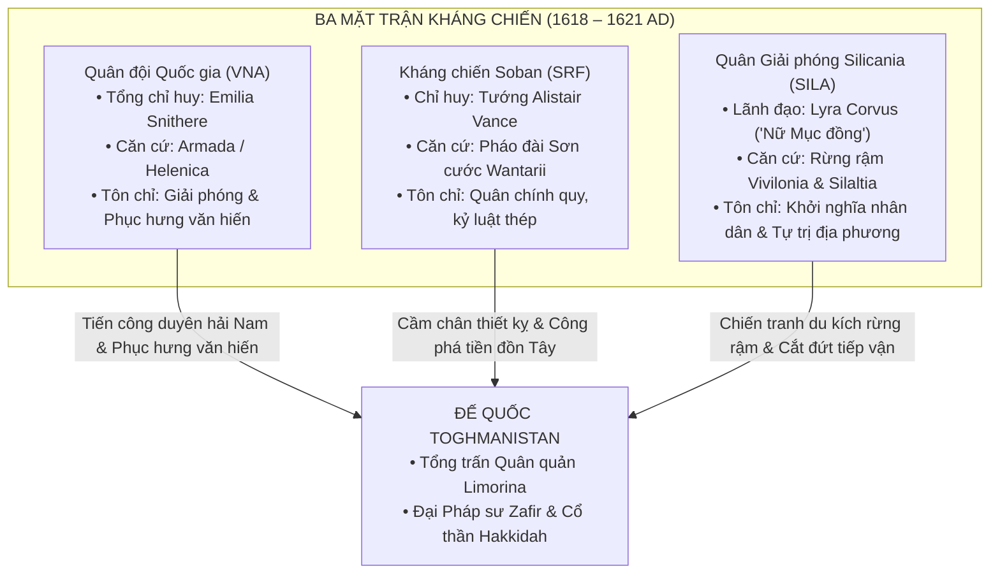
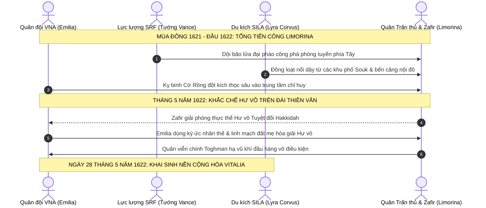

# Lịch sử Vitalia: Kỷ nguyên Đại Phục Quốc và Nền Cộng hòa Vitalia (1580 – 1622 AD)

> **Chuỗi tài liệu Bối cảnh Lịch sử Vitalia**:
> [Phần I: Cổ đại & Sơ kỳ Trung Cổ](./01-prior-to-middle-ages.md) · [Phần II: Hậu kỳ Morrazalina & Thịnh vượng chung (880 – 1029 AD)](./02-late-morrazalina-and-commonwealth.md) · [Phần III: Thời kỳ Đô hộ Toghmanistan (1029 – 1580 AD)](./03-toghmanist-rule-and-resistance.md) · **Phần IV: Đại Phục Quốc & Nền Cộng hòa (1580 – 1622 AD)**

Sau nhiều thế kỷ Toghman kiểm soát phần lớn Vitalia, giai đoạn 1580–1622 AD chứng kiến các làn sóng khởi nghĩa, sự liên kết giữa ba mặt trận kháng chiến và sự xuất hiện của nữ anh hùng mang dòng máu bất tử **Emilia Alexandrina Morrazalina** (*Emilia Snithere*). Giai đoạn này kết thúc bằng việc đánh bật chính quyền Toghman khỏi Vitalia và khai sinh **Nước Cộng hòa Vitalia** vào ngày 28 tháng 5 năm 1622.

---

## Quy ước chú thích

* **Ký hiệu `[]`**: Dẫn chiếu thông tin hoặc đối sánh bối cảnh lịch sử, triết học chính trị thế giới thực.
* **Ký hiệu `()`**: Chú thích tên bản địa, bí danh, chuyển tự tiếng Vitalia / tiếng Toghman hoặc niên đại.
* **Địa danh & Thực địa Trấn phủ**: Chuẩn hóa dựa trên hệ thống 15 địa hạt (*Counties*) theo bản đồ địa bạ và mạng lưới thành thị (*Burgs*).

---

## 1. Khúc Dạo Đầu: Các Cuộc Khởi Nghĩa Tiền Đề (1580 – 1613 AD)

Trước khi cuộc tổng khởi nghĩa của ba mặt trận bùng nổ vào thập niên 1610, sự suy tàn của Đế quốc Toghmanistan cùng hậu quả của trận đại dịch Cơn Sốt Đen (1542 – 1546 AD) đã tạo thời cơ cho các cuộc nổi dậy vũ trang đầu tiên bùng phát trên khắp các trấn phủ:

### 1.1. Cuộc Khởi nghĩa Thảo nguyên Miền Bắc tại Thornor & Silaltia (1584 – 1593 AD)
* **Bối cảnh thực địa**: Vùng đất cao nguyên phía Bắc gồm địa hạt **Thornor** (*Iqlīm Thurnūr*), **Chamliova** (*Wilāyat Çamliyūfa*) và nửa phía nam của địa hạt **Silaltia** (*Wilāyat Silālṭiya*) là nơi quân đồn trú Toghman mỏng nhất sau khi rút lui phòng ngự.
* **Diễn biến**: Một thủ lĩnh dân binh bản địa là **Kaelen Râu Đỏ** (*Kaelen se Rēada*) liên kết các phường thợ săn và tiễn thủ thảo nguyên, đồng loạt đánh úp 8 đơn vị thành thị (*Burgs*) tại Thornor. Nghĩa quân quét sạch các đồn binh thu thuế, thành lập vùng kiểm soát tự do kéo dài gần 10 năm.
* **Ý nghĩa**: Dù sau đó bị kỵ binh thiết giáp Shaddad từ Almaka kéo lên đàn áp đẫm máu vào năm 1593 AD, cuộc khởi nghĩa Thornor đã chứng minh quân chiếm đóng không còn đủ quân số để kiểm soát toàn bộ lãnh thổ.

### 1.2. Biến loạn Cảng Brampton & Vùng Duyên Hải Loutheton (1601 – 1606 AD)
* **Bối cảnh thực địa**: Địa hạt **Loutheton** và thương cảng duyên hải **Brampton** thuộc địa hạt **Feland** là hai yết hầu kinh tế hàng hải biển Bắc.
* **Diễn biến**: Bất bình trước "Sắc lệnh Thuế Thuyền bến" cưỡng đoạt 70% lợi nhuận thương mại để chi viện cho chiến tranh phương Nam, các bang hội thợ đóng tàu và dân chài Brampton liên minh với thị trấn cảng Loutheton và các tư sản thành phố Maclif (tiếng Vitalia cổ là *Maeclig*) đã phát động binh biến. Họ đánh chìm toàn bộ soái hạm của hạm đội tuần duyên Toghman, chiếm giữ ngọn hải đăng và pháo đài cửa biển suốt 5 năm.
* **Kết cục**: Cuộc phong tỏa đường biển buộc chính quyền Tổng trấn tại Limorina phải nhượng bộ một phần thuế khóa, tạo điều kiện cho các xưởng đóng tàu bí mật chế tạo thuyền chiến đáy bằng phục vụ kháng chiến sau này.

### 1.3. Cánh quân Lưu vong của Hector Hinderland (1608 – 1612 AD)
* **Xuất thân**: Tự xưng là hậu duệ trực hệ mang danh xưng của vị anh hùng lập quốc Hector Hinderland từ thời Thịnh vượng chung (1015 AD).
* **Hoạt động**: Tập hợp tàn dư các hiệp sĩ quý tộc lưu vong tại vùng rừng đồi phía Đông **Blandfordia** và địa hạt **Hatre**. Hector lãnh đạo một đội quân thiện chiến, nhiều lần phục kích gây thiệt hại nặng nề cho các đoàn xe áp tải vàng của Đế quốc, đánh chiếm sâu phía đông và làm chủ nửa phía bắc địa hạt Helythwia thuộc Trấn phủ Riralia (ngày nay thuộc tỉnh Nova Hibernia của CH Vitalia).
* **Hạn chế mang tính chí mạng**: Mang nặng tư tưởng quý tộc phong kiến hẹp hòi và tham vọng phục dựng ngai vàng dòng họ, Hector sẵn sàng dùng dân làng làm mồi nhử để đạt mục tiêu quân sự—chính sự tàn nhẫn này đã gieo mầm cho sự rạn nứt nội bộ và dẫn đến sự chia rẽ với Emilia sau này.

---

## 2. Ngọn Lửa Bùng Cháy: Sự Xuất Hiện của Emilia Snithere (1613 – 1618 AD)

### 2.1. Giấc Mơ và Vỡ Mộng tại Học viện Phép thuật Limorina (Năm 1613 AD)

#### Thân thế và những năm tháng ấu thơ
Emilia sinh vào mùa thu năm 1597 tại vùng thảo nguyên lộng gió Helenica. Khi cô vừa chào đời, người cha đã biệt tích, còn người mẹ được cho là đã qua đời sớm trong cảnh bần hàn. Đứa trẻ côi cút mang trong mình dòng máu vương tộc Morrazalina cổ xưa đã được Vương nữ bất tử **Elaina Morrazalina** đón nhận và nuôi dưỡng trong vòng tay bao bọc tại thung lũng sương mù Armada. 

Lớn lên giữa sự tĩnh lặng của non ngàn, Emilia sớm bộc lộ năng khiếu ma thuật vượt bậc. Nhận thấy tài năng thiên bẩm và khát vọng tri thức của cô, quan Tổng trấn Helenica đương thời là **Temujin Jalayir** (1569 – 1642)—một vị quý tộc Toghman có tư tưởng cởi mở và thiện cảm sâu sắc với văn hóa bản địa—đã đứng ra bảo trợ pháp lý, cho phép cô rời thung lũng để theo học tại Học viện Phép thuật Đế quốc ngay tại trung tâm kinh thành Limorina.

#### Mầm mống lý tưởng và tình bạn tri kỷ
Năm 1613 AD, ở tuổi 16, Emilia là một trong những học viên xuất sắc và kín đáo nhất viện. Dưới vỏ bọc của một nữ sinh khiêm nhường, nỗi uất nghẹn trước cảnh đồng bào bị đọa đày luôn âm ỉ trong lòng cô. Emilia bí mật tham gia hội kín nghiên cứu văn hóa và ngôn ngữ Vitalia cổ dưới sự che chở của giáo viên chủ nhiệm—Thượng cấp Pháp sư **Fatima Murwarid Al-Sayeed** (1566 – 1646, người phụ nữ gốc Toghman có tấm lòng nhân ái, sau này được biết đến với tên bản địa là *Margarita Abigail Broun*). Chính tại đây, lần đầu tiên Emilia được tiếp cận với các bản thảo lịch sử nguyên bản, thấu suốt ngọn nguồn tự do và giá trị thiêng liêng của bản sắc dân tộc.

Cũng tại học viện, cô kết giao cùng **Gerald Robinson** (1590 – 1678), con trai của cựu Tổng trấn Limorina Edmund Robinson. Không sở hữu ma lực áp đảo, Gerald lại có nhãn quan chiến thuật sắc sảo, tư duy tổ chức điềm tĩnh và một ý chí kiên định. Thấu hiểu và đồng cảm sâu sắc với lý tưởng của Emilia, anh trở thành người bạn đồng hành tin cậy, kề vai sát cánh và là điểm tựa tinh thần vững chắc trong suốt cuộc đời người nữ anh hùng.

#### Sắc lệnh Thuế Ngoại đạo và Cuộc đàn áp đẫm máu
Tháng 9 năm 1613 AD, bầu không khí ngột ngạt bao trùm khắp bờ cõi khi chính quyền thực dân Toghmanistan ban hành "Sắc lệnh Thuế Ngoại đạo" hà khắc, cưỡng đoạt tài sản của các gia đình thị dân bản địa và đe dọa đẩy hàng vạn người vào cảnh cùng quẫn. Biến cố bùng nổ khi gia đình một người bạn học nghèo của Emilia bị tịch thu toàn bộ gia sản, người cha già bị cùm chân giải đi lao dịch khổ sai nơi hầm mỏ Wantarii.

Không thể tiếp tục cam chịu, vận dụng tài hùng biện và kiến thức luật pháp Đế quốc, Emilia đã đứng lên hiệu triệu cuộc biểu tình ôn hòa quy mô lớn của học sinh, sinh viên và thị dân khắp Limorina và Amelia. Ban đầu, cuộc tuần hành diễn ra trật tự, thu hút sự hưởng ứng rộng rãi của công chúng và khiến triều đình Tổng trấn bối rối.

Tuy nhiên, bản chất của thể chế cai trị thực dân là bạo lực. Chính quyền Toghmanistan bí mật cài cắm những kẻ khiêu khích gây náo loạn, lấy cớ đó điều cấm quân thiết giáp kéo đến đàn áp dữ dội. Trước lưỡi đao bổ xuống những người bạn tay không tấc sắt, trong nỗ lực giải cứu đồng bào khỏi thảm cảnh diệt sát, Emilia bộc phát năng lượng tiềm ẩn: cô thi triển **Huyết thuật (*Blōd Wiccecræft*)**—thứ ma thuật cổ xưa của đất Vitalia có uy lực kinh thiên động địa nhưng bị Đế quốc nghiêm cấm bởi đòi hỏi sự tiêu hao sinh lực khủng khiếp. Luồng sóng xung kích ma thuật đỏ thẫm hất văng kỵ binh đàn áp, cứu thoát nhóm học viên trong gang tấc. Song Huyết thuật đã để lại một dấu vết ma lực dị thường—thứ mà sau này Đại Pháp sư Zafir al-Mansur đã khai thác để ráo riết truy lùng cô.

Emilia lập tức bị trục xuất khỏi học viện với tội danh phản nghịch và bị phát lệnh truy nã gắt gao trên toàn lãnh thổ. Nếm trải thất bại đầu đời, cô gái trẻ nhận ra chân lý nghiệt ngã: *sự ôn hòa và khuôn khổ luật pháp của kẻ áp bức không bao giờ có thể mang lại tự do cho một dân tộc đang chịu cảnh xiềng xích*.

---

### 2.2. Dưới Ngọn Cờ Hinderland và Sự Rạn Nứt Lý Tưởng (1614 – 1615 AD)

Trở thành kẻ đào tẩu bị truy nã, Emilia phải trốn chạy khỏi Limorina nhờ mạng lưới liên lạc bí mật do mẹ nuôi Elaina gây dựng. Ban đầu, cô nương náu tại tư dinh của quan Tổng trấn Vivilonia Ahmad Borjigin ở thành phố Axbriden (địa hạt Hatre). Nhận thấy việc ẩn náu thụ động không thể giải quyết vận mệnh dân tộc, vào tháng Giêng năm 1614 AD, Emilia vượt đồi núi hiểm trở tìm đến căn cứ quân đoàn lưu vong của **Hector Hinderland** tại vùng rừng núi Blandfordia. Cô đặt niềm tin vào dòng dõi của vị Bảo Hộ Công từng lãnh đạo nền Thịnh vượng chung 600 năm trước như ngọn cờ quy tụ cho đại nghiệp cứu quốc.

Tại doanh trại nghĩa quân, dù được nể trọng nhờ năng lực chiến đấu xuất chúng, Emilia sớm trở thành mối lo ngại đối với Hector. Trước sự mẫn tiệp và uy tín ngày một lớn của cô gái 17 tuổi, thói đố kỵ và tính độc đoán của Hector trỗi dậy. Ông ta tước bỏ vai trò tiền tuyến của Emilia, điều chuyển cô về phụ trách công tác hậu cần và sổ sách quân lương.

Thế nhưng, thử thách ấy lại làm rực sáng tài năng quản trị của cô. Trước năm 1614, toàn bộ sổ sách tài chính của nghĩa quân đều bị ghi chép tùy tiện, thất thoát nghiêm trọng. Sau khi tiếp quản, Emilia chấn chỉnh toàn bộ hệ thống kho tàng, kiểm toán từng khoản chiến phí, giúp nghĩa quân tích lũy được nguồn lực đáng kể để rèn đúc vũ khí và dự trữ quân lương. Không dừng lại ở đó, trước sự bế tắc của các chỉ huy tiền phương, Emilia đã chủ động chỉ huy một phân đội cơ động vượt qua vùng đầm lầy hiểm trở giữa Stapseazion và pháo đài Letze (nay thuộc tỉnh Nova Hibernia), giải cứu thành công nhiều toán nghĩa binh bị quân Toghman bao vây cô lập.

Dẫu vậy, khoảng cách về lý tưởng giữa hai thế hệ ngày càng lộ rõ. Mùa hè năm 1615 AD, Hector lên kế hoạch phục kích một đoàn xe áp tải vàng của Đế quốc nhằm tìm kiếm một thắng lợi quân sự vang dội. Để bảo đảm chắc thắng, ông ta vạch ra mưu kế tàn nhẫn: cố tình tung tin tình báo giả để dụ quân Toghman tràn vào cướp phá một ngôi làng nông dân vô tội gần đó làm mồi nhử nghi binh.

Khi kế hoạch tàn độc này đến tai Emilia, cô phẫn nộ tột cùng. Đối diện với Hector giữa đại bản doanh, cô dõng dạc cất lên tiếng nói lương tri làm chấn động toàn thể tướng sĩ:

> *"Mạng sống của nhân dân không phải là những con tốt trên bàn cờ quyền lực của ngài, thưa Lãnh chúa!"*

Bất chấp lệnh cấm quân luật, Emilia đơn thương độc mã dẫn một phân đội nhỏ bí mật đột nhập vào làng trong đêm, kịp thời hướng dẫn toàn bộ hàng trăm thường dân sơ tán vào rừng sâu trước khi quân chiếm đóng ập tới. Dân làng được bảo toàn tính mạng, nhưng kế hoạch phục kích của Hector bị bại lộ hoàn toàn. Trong cơn giận dữ vì mất mẻ vàng, Hector tước bỏ mọi danh phận và trục xuất Emilia khỏi hàng ngũ nghĩa quân.

---

### 2.3. Trở Về Armada và Thức Tỉnh Ma Thuật Sự Sống Của Cội Nguồn (1616 – 1618 AD)

Mùa đông năm 1616 AD, Emilia quay trở về thị trấn cổ Armada (địa hạt Helenica) trong nỗi dằn vặt sâu sắc sau thất bại cay đắng. Nhưng tại thung lũng sương mù bất khả xâm phạm, Vương nữ bất tử **Elaina Morrazalina** đã dang rộng vòng tay đón nhận cô bằng tình mẫu tử thiêng liêng. Cùng với sự săn sóc ân cần của người chị hiền hậu **Angelina Semyonovskaya** và tinh thần lạc quan của cô em họ **Limorina Archangeli-Morrazalina**, tâm hồn Emilia từng bước được hồi sinh.

Trong những tháng ngày tĩnh dưỡng, Elaina kiên nhẫn khai mở cho Emilia tri thức về **Ma thuật Sự Sống cổ xưa của Maperia**—loại ma thuật gắn liền với linh mạch đất đai, thảm thực vật và hơi thở của muôn loài, đối lập hoàn toàn với thứ ma thuật công thức hủy diệt cứng nhắc của Đế quốc Toghmanistan. Elaina cũng hé lộ về di sản của mẫu vương—Nữ vương **Aglaea II** (tên khai sinh là **Illumia Morrazalina Dervisch**). Nhờ "Con Mắt Thần" (*The Divine Sight*), Nữ vương Illumia đã nhìn thấy trước thảm họa mất nước và đã phong ấn một thánh vật cùng lời sấm truyền về một hậu duệ mang "Dấu ấn Ánh Trăng" sẽ xuất hiện để cứu chuộc giang sơn. Trong những đêm thiền định sâu dưới bầu trời Armada, Emilia luôn cảm nhận được một vầng trăng bạc vô hình tĩnh lặng soi chiếu tâm khảm mình.

Suốt hai năm (1617 – 1618 AD), Emilia cùng Elaina rong ruổi khắp các nẻo đường thảo nguyên Maperia. Bằng ma thuật sự sống, cô học cách kết nối với đất mẹ, hồi sinh những vùng đất đai cằn cỗi bị tàn phá vì khói lửa chiến tranh, thanh lọc các dòng suối ô nhiễm và che chở các bản làng hẻo lánh khỏi nanh vuốt của các toán tuần tiễu Toghman. Danh tiếng của một "pháp sư sự sống" mang trái tim nhân ái lan tỏa khắp các địa hạt, biến cô từ một người đào tẩu thành biểu tượng hy vọng mới của toàn cõi phương Nam.

---

### 2.4. Trận Phòng Thủ Thành Armada và Khai Sinh Biểu Tượng "Emilia Snithere" (1618 AD)

Sự hồi sinh mạnh mẽ của Maperia nhanh chóng kinh động đến bộ chỉ huy thực dân tại Limorina. Đầu năm 1618 AD, một đạo quân viễn chinh được phái đến nhằm san bằng pháo đài Armada và dập tắt ngọn lửa tự do. Kẻ thống lĩnh đạo quân này chính là quan tướng thực dân tàn bạo **Dimitri Saladin**. Cay đắng thay, Dimitri chính là người cha ruột năm xưa đã ruồng bỏ gia đình và đứa con thơ Emilia trong cảnh khốn cùng để chạy theo bổng lộc, tước vị của Đế quốc. Mang nặng mặc cảm tội lỗi của kẻ phản bội, hắn muốn chứng minh lòng trung thành với ngoại bang bằng sự tàn độc cùng cực: hắn hạ lệnh thảm sát cư dân ngoại vi Armada nhằm thị uy và mưu toan cắt đứt quá khứ nhục nhã của mình.

Trận chiến thành Armada vào tháng 5 năm 1618 AD trở thành cuộc thử thách định mệnh giữa hai thế giới quan, giữa ma thuật hủy diệt tàn bạo và ma thuật sự sống kiên cường. Trước cổng thành Armada, Dimitri tung ra các luồng hỏa thuật hủy diệt hòng phá vỡ phòng tuyến, nhưng Emilia lần đầu tiên vận dụng trọn vẹn sức mạnh linh mạch Maperia, dựng nên kết giới ánh sáng ngọc bích đẩy lùi mọi đòn tấn công. Bằng ma thuật sinh trưởng, cô điều khiển rễ cây ngàn năm tước bỏ vũ khí và đánh gục kẻ bạo tàn. Dẫu mang trong lòng nỗi đau của một đứa con bị chối bỏ, Emilia kiềm chế lưỡi gươm, khước từ việc tự tay sát hại cha mình. Nhưng công lý đã được thực thi bởi chính lòng dân: những binh sĩ Vitalia bị cưỡng bách phục vụ trong quân ngũ thực dân, sau khi chứng kiến sự cao thượng của Emilia và quá phẫn nộ trước tội ác của Dimitri, đã đồng loạt nổi dậy bắt giữ viên tướng phản bội và xử tội hắn ngay tại quảng trường Armada.

Chiến thắng vang dội biến Emilia thành biểu tượng bảo hộ của Armada. Để bước vào cuộc trường chinh giải phóng dân tộc và khước từ mọi tước vị quý tộc rỗng tuếch, cô quyết định chọn bí danh **Emilia Snithere** (bắt nguồn từ danh từ tác nhân Cổ ngữ *snīðere / snithere*, mang nghĩa "Người thợ may"; các dị bản ngoại bang về sau ghi nhầm là *Schneider*). Cái tên mộc mạc ấy mang lời thề thiêng liêng: *nguyện làm người thợ dùng sợi chỉ của lòng quả cảm và tình yêu thương để may vá, hàn gắn lại một Vitalia đã bị ngoại bang xé rách nát suốt gần sáu trăm năm*.

Vào ngày **28 tháng 5 năm 1618**, tại quảng trường ngập tràn cờ hoa của Armada, **Quân đội Quốc gia Vitalia (*Vitalia National Army - VNA*)** chính thức làm lễ tuyên thệ thành lập trên nền tảng Lực lượng Phòng vệ Maperia do Elaina lãnh đạo, suy tôn Emilia Snithere làm Tổng tư lệnh tối cao. Vượt qua hàng trăm dặm đường hiểm trở bị phong tỏa, **Gerald Robinson** là một trong những người đầu tiên tìm về đứng dưới ngọn cờ của cô, sẵn sàng cống hiến trọn vẹn tài năng chiến thuật cho ngày toàn thắng.

---

## 3. Ba Mặt Trận, Một Kẻ Thù & Thảm Họa Siêu Nhiên (1618 – 1621 AD)

Từ năm 1618 AD, cục diện kháng chiến trên vùng đất Vitalia được định hình bởi ba lực lượng độc lập trên ba mặt trận chiến lược:

### 3.1. Tiếng Vọng Khắp Giang Sơn: Cục Diện Ba Mặt Trận (1618 – 1620 AD)

Chiến thắng mang tính bước ngoặt của Emilia Snithere tại cửa ải Armada lập tức làm xoay chuyển bàn cờ chính trị trên toàn cõi Vitalia. Tin tức về một nữ tư lệnh trẻ tuổi khoác áo vương tộc cổ, đánh tan đạo quân thiện chiến của Dimitri Saladin, đã thổi bùng ngọn lửa hy vọng vào những lực lượng kháng chiến vốn đang bị phân tán và kiệt quệ:

1. **Lực lượng Kháng chiến Soban (SRF) – Tướng Alistair Vance**:
   Ẩn mình trong chuỗi pháo đài sơn cước Wantarii hiểm trở miền Tây, Tướng Alistair Vance—một cựu tướng lĩnh danh tiếng từng phục vụ trong quân đội Đế quốc trước khi đào ngũ vì không thể dung thứ các sắc lệnh tàn sát thường dân—chăm chú theo dõi thời cuộc. Mang nỗi dằn vặt sâu sắc của một quân nhân từng lầm lạc trong bộ máy thực dân, Vance trân trọng tài năng điều binh thần tốc của Emilia nhưng giữ thái độ hoài nghi nghiêm cẩn đối với chủ nghĩa lãng mạn cách mạng và những giai thoại ma thuật thần thánh. Với tầm nhìn của một nhà chiến lược thực thụ, ông nhận ra cánh quân VNA ở phương Nam chính là gọng kìm hoàn hảo để chia cắt quân chủ lực của Tổng trấn Limorina. Vance chủ động cử đoàn sứ bộ bí mật vượt núi đến Armada, đặt nền móng cho một hiệp ước phối hợp tác chiến thận trọng nhưng mang tính sống còn.

2. **Quân Giải phóng Silicania (SILA) – Lyra Corvus ("Nữ Mục đồng Silaltia")**:
   Băng qua những cánh rừng bạt ngàn Vivilonia và thảo nguyên Silaltia, Lyra Corvus—người nữ thủ lĩnh xuất thân từ tầng lớp bần nông chăn cừu với tài hùng biện và sức lôi cuốn phi thường—lại nhìn những bản cáo thị ca tụng dòng dõi Morrazalina bằng con mắt cảnh giác của giai cấp lao động. Trải qua nửa thiên niên kỷ bị đè nén, người dân Silicania lo sợ đây chỉ là mưu đồ của một nhánh quý tộc tàn dư muốn mượn xương máu thảo dân để tái lập ngai vàng phong kiến. Để kiểm chứng bản chất của VNA, Lyra cử những trinh sát dạn dày sương gió nhất bí mật thâm nhập vào các vùng giải phóng của quân đội Emilia.

3. **Phương châm "Vừa Đánh Vừa Dựng" (*Wigende and Timbrende*) và Phong trào Phục hưng Văn hiến**:
   Điều khiến trinh sát của Lyra kinh ngạc không phải là quân số hay vũ khí của VNA, mà là trật tự xã hội được khai sinh ngay sau mũi giáo giải phóng. Dưới quyền chỉ huy của Emilia và sự quản trị mẫn cán của Gerald Robinson, VNA không hành xử như một lực lượng chiếm đóng quân sự. Họ ban hành lệnh bãi bỏ toàn diện văn thư hành chính bằng chữ Toghman, khôi phục việc giảng dạy tiếng mẹ đẻ Vitalia trong các trường công lập địa phương, hỗ trợ nông dân tái thiết hệ thống thủy lợi, và tổ chức lại các ngày hội diễn xướng sử thi dân gian cùng các nghi lễ tưởng niệm tổ tiên vốn bị cấm đoán suốt gần sáu trăm năm. Nhận thấy VNA thực sự chiến đấu vì linh hồn và quyền sống của muôn dân chứ không vì hư danh vương quyền, Lyra Corvus chính thức gửi thông điệp kết nghĩa liên minh, gắn kết sức mạnh du kích rừng rậm miền Bắc với đại quân Nam tiến.

---

### 3.2. Bóng Ma Hư Vô Tuyệt Đối và Mối Thù Của Đại Pháp Sư Zafir

Giữa lúc liên minh kháng chiến từng bước siết chặt vòng vây, một nhân vật đặc biệt tìm đến phòng tuyến VNA: **Kael Vordis**, một cựu "Giám vật Quan" (*Fyrn-sōcere / Relic Seeker*) đào ngũ từ Viện Cổ vật Hoàng gia của Đế quốc. Kael mang theo tài liệu tuyệt mật phơi bày hiểm họa hủy diệt khủng khiếp nhất mà vùng đất này từng đối mặt: trước viễn cảnh chế độ đô hộ sụp đổ, Đại Pháp sư Tối cao **Zafir al-Mansur** đã bí mật chuẩn bị nghi thức triệu hồi **Hakkidah**—thực thể Cổ thần Hư vô đại diện cho sự tĩnh chỉ vĩnh hằng và cái chết tuyệt đối của vạn vật.

Kael cũng vén bức màn tâm lý bi kịch của kẻ thù tối thượng: Zafir không đơn thuần là một bạo chúa khát máu vì tín điều thuộc địa, mà là một linh hồn bị biến dạng bởi hận thù thế kỷ. Bốn mươi năm trước, trong một cuộc bạo loạn nông dân đẫm máu ở vùng biên ải, toàn bộ gia tộc của Zafir đã bị tàn sát man rợ. Nỗi đau ấy gieo vào tâm trí viên đại pháp sư một sự ghê tởm tận cùng đối với tính cách bộc phát, hỗn loạn của thế gian phàm trần. Trong cơn cuồng loạn triết học, Zafir đi đến kết luận rằng mọi sinh mệnh hữu hạn đều đồng nghĩa với xung đột và thống khổ; chỉ có sự đóng băng vĩnh cửu của Hư vô—nơi không còn sinh diệt, không còn ký ức hay cảm xúc—mới là "trật tự hoàn hảo tuyệt đối" để thanh tẩy vùng đất này.

Cũng chính Kael Vordis là người đầu tiên kinh ngạc nhận ra bản chất quầng sáng quanh thân Emilia: đó không phải là ma pháp vay mượn hay tà thuật kích phát đoản thọ, mà là hào quang ánh trăng bạc nguyên thủy (*Mōna-Glēam*)—dấu chỉ của dòng dõi vương quyền cổ xưa nhất gắn liền với linh mạch sinh tồn của Vitalia.

---

### 3.3. Huyết Chiến Hẻm Núi Güneydere: Sự Hy Sinh Của Angelina và Dấu Ấn Ánh Trăng (1620 AD)

Mùa thu năm 1620 AD, liên quân VNA mở chiến dịch quy mô lớn đánh chiếm **Hẻm núi Güneydere** (địa hạt Almaka)—yết hầu giao thông hiểm trở nối liền miền trung thổ Vitalia với đại lộ tiếp viện từ chính quốc Toghmanistan ở phía nam. Nhận thức rõ nếu để mất Güneydere, toàn bộ lực lượng đồn trú sẽ biến thành ốc đảo cô lập, Zafir đích thân ngự giá trên đỉnh vách đá hoa cương, triển khai đại trận đồ phong ấn. Lão cưỡng ép giải phóng một phần thực thể Hakkidah, giáng xuống thung lũng một làn sương đen hư vô nuốt chửng ánh dương, biến vũ khí kim loại thành rỉ sét mục nát và hút cạn sinh lực của hàng vạn nghĩa sĩ trong chớp mắt.

Trước cảnh tượng liên quân đứng bên bờ vực diệt vong hoàn toàn, người chị gái dịu hiền luôn sát cánh bên Emilia—**Angelina Semyonovskaya**—đã lặng lẽ bước ra trận tiền. Trong khoảnh khắc sinh tử tột cùng, Angelina buông bỏ lớp ngụy trang che giấu suốt hai mươi năm, phóng thích toàn bộ sinh mệnh tinh hoa của một truyền nhân Morrazalina thuần huyết. Cô dệt nên một vòng kết giới nghịch chuyển không gian (*Wiðer-Trum*), lấy thân mình làm vật dẫn chặn đứng dòng chảy hư vô đang tràn xuống thung lũng. Kết giới giữ vững để đại quân kịp thời xốc lại đội hình phản công, nhưng nhục thân của Angelina dần tan biến thành những dải ánh sáng li ti phiêu tán vào hư không trước ánh nhìn chết lặng của Emilia.

Trong tiếng gào khóc nghẹn ngào giữa đống tro tàn, Vương nữ Elaina quỳ xuống bên Emilia và tiết lộ bí mật cay đắng đã được chôn giấu suốt hai thập niên: Angelina không phải là người chị họ xa, mà chính là **người mẹ ruột** đã mang nặng đẻ đau sinh ra Emilia trong cảnh ngục tù lưu đày. Vì muốn bảo vệ đứa con thơ khỏi sự lùng quét tàn khốc của mật thám thuộc địa, người mẹ trẻ đã chấp nhận từ bỏ thiên chức, hạ mình làm một người chị gái nghèo hèn để sớm hôm bảo bọc, chở che giọt máu duy nhất của gia tộc.

Nỗi đau đớn xé toạc tâm can đã làm vỡ tan tầng phong ấn linh hồn cuối cùng: **Dấu ấn Ánh Trăng (*Mōna-Tācn*)**—di sản ngàn năm bắt nguồn từ Nữ vương Aglaea II Illumia—bừng tỉnh rực rỡ trên ấn đường Emilia. Ánh trăng thuần khiết rọi sáng màn đêm Güneydere, quét sạch tàn dư ô uế của làn sương đen.

Thừa kế quyền năng tối thượng của dòng máu Morrazalina, cơ thể Emilia ngừng lão hóa hoàn toàn, các vết thương chiến trận lập tức khép lại, và sinh lực trở nên vô tận. Nhưng cái giá của sự bất tử là một gánh nặng tâm linh khủng khiếp: cảm giác về thời gian của cô bắt đầu tách rời khỏi nhịp sống phàm trần; nỗi bi thương mất mẹ, ngọn lửa phẫn nộ cùng mọi xúc cảm nhân loại dường như bị một lớp băng giá vĩnh cửu bao phủ, đe dọa biến cô thành một thực thể siêu nhiên vô cảm trước nỗi đau của thế nhân. Đối mặt với cuộc khủng hoảng hiện sinh sâu sắc nhất cuộc đời, chính sự hiện diện kiên trung, bàn tay ấm áp của Gerald Robinson và những giọt nước mắt đồng loại của tướng sĩ VNA đã giữ chặt linh hồn Emilia ở lại với nhân gian.

---

### 3.4. Khủng Hoảng Niên Biểu và Hội Nghị Thống Nhất Tu Viện Vivilonia (1621 AD)

Đầu năm 1621 AD, Hector Hinderland—bị cô lập bởi uy tín ngày càng dâng cao của Emilia và điên cuồng tìm kiếm một chiến công độc tôn nhằm khôi phục danh vọng quý tộc cũ—đã tự ý xua đạo quân riêng liều lĩnh đột kích vào trung tâm phòng ngự của kỵ binh Shaddad. Cuộc phiêu lưu quân sự mù quáng kết thúc bằng một thảm bại kinh hoàng: toàn bộ cánh quân Hinderland bị xóa sổ tại thung lũng đá xám, bản thân Hector bỏ mạng trên lưng ngựa trong nỗi cay đắng tột cùng. Cái chết của Hector giáng đòn quyết định chấm dứt hoàn toàn tàn dư của chủ nghĩa quân phiệt cát cứ; hàng ngàn binh sĩ còn sống sót đã vượt ngàn dặm tìm về sáp nhập vào hàng ngũ VNA.

Cùng lúc đó, các đợt tế lễ hư vô của Zafir bắt đầu gây ra những biến dị thổ nhưỡng dữ dội trên khắp lãnh thổ: linh mạch đất đai bị rút cạn khiến mùa màng héo rũ, những cơn giông bất thường mang theo tro bụi làm tê liệt sinh hoạt. Đỉnh điểm là sự kiện một tiền đồn chiến lược của SRF tại chân núi Wantarii bị quân Đế quốc tập kích tiêu diệt, bắt nguồn từ sai sót trinh sát của một toán du kích SILA địa phương. Căng thẳng bùng nổ, sự hoài nghi giữa tầng lớp cựu sĩ quan quý tộc của Vance và lực lượng bần nông của Lyra Corvus dâng cao đến mức suýt dẫn tới xung đột vũ trang nội bộ.

Trước nguy cơ liên minh tan rã giữa thời khắc quyết định, Emilia Snithere triệu tập Hội nghị Thống nhất lịch sử tại tu viện cổ Vivilonia vào đầu mùa xuân năm 1621 AD. Không khí đại sảnh tu viện ngột ngạt như một chiến trường chính trị thu nhỏ:
* *Vòng 1 (Bất đồng đường lối)*: Tướng Alistair Vance kiên quyết yêu cầu thiết lập một bộ tư lệnh tối cao tập quyền, áp đặt kỷ luật quân đội chính quy lên toàn bộ các cánh du kích; ngược lại, Lyra Corvus kịch liệt phản đối, cảnh báo nguy cơ tái lập ách cai trị quý tộc chuyên chế và đòi hỏi quyền tự quyết tuyệt đối cho các công xã nông dân.
* *Vòng 2 (Nhận thức sinh tồn)*: Kael Vordis bước ra giữa hội nghị, sử dụng cổ vật thiên văn tái hiện bức tranh chân thực về thảm cảnh diệt chủng mà thực thể Hakkidah sẽ giáng xuống một khi phong ấn hoàn toàn bị phá vỡ. Trước bờ vực diệt vong không chừa một ai, các chỉ huy bàng hoàng nhận ra mọi toan tính vị kỷ hay hận thù giai cấp đều trở nên vô nghĩa.
* *Vòng 3 (Đại đoàn kết dân tộc)*: Emilia bước lên vũ đài trung tâm. Không dùng uy thế của một Đại Pháp sư bất tử để thị uy, cô cởi bỏ chiến bào chỉ huy, nói bằng tiếng nói chân thành của một người con Vitalia mang vết thương mất mẹ và thấu hiểu nỗi đau chung của giống nòi. Cô đưa ra bản kiến trúc quyền lực dung hòa mang tính lịch sử—**Hội đồng Liên hiệp Kháng chiến (*United Resistance Council*)**:
  * Trao cho Tướng Alistair Vance cương vị **Tổng tư lệnh Tác chiến Chính quy**, toàn quyền chỉ huy chiến thuật và hợp nhất các binh chủng;
  * Cam kết với Lyra Corvus bản **Hiến chương Dân quyền Tự do**, bảo đảm quyền sở hữu ruộng đất, quyền tự trị của các hạt và vị thế bình đẳng tuyệt đối của tầng lớp thường dân trong thể chế tương lai;
  * Bản thân Emilia đứng ở vị trí ngọn cờ tập hợp tinh thần, chịu trách nhiệm phong tỏa và hóa giải các đòn đánh ma thuật siêu nhiên của Zafir.

Tầm nhìn chính trị bao dung và đức hy sinh vô điều kiện của Emilia đã lay chuyển toàn bộ hội nghị. Tướng Vance hạ kiếm cúi đầu, Lyra Corvus siết chặt bàn tay cô trong nước mắt. Lần đầu tiên sau hơn 590 năm chia rẽ và vong quốc, các giai cấp trên toàn lãnh thổ Vitalia hòa làm một dưới một khối ý chí sắt đá duy nhất.

---

## 4. Đại Chiến Limorina & Khai Sinh Nền Cộng Hòa (1621 – 1622 AD)

### 4.1. Đêm Tối Của Tâm Hồn Trước Giờ Xuất Kích

Đêm trước ngày phát động chiến dịch tổng lực giải phóng Limorina, trong căn lều dã chiến ven bờ sông Kintazion mịt mù sương muối, Emilia trải qua những giờ phút cô đơn và tăm tối nhất của tâm hồn. Gánh nặng sinh mệnh của hàng vạn đồng bào dồn lên đôi vai, nỗi đau mất mẹ vẫn rỉ máu trong ngực áo, cùng cảm giác lạnh giá kỳ quặc từ thể xác bất tử khiến người phụ nữ trẻ chìm vào khoảng lặng hoang mang tột cùng. Đứng trước tấm gương đồng mờ đục trong ánh nến leo lét, nhìn dung nhan trẻ mãi không già phản chiếu giữa không gian tĩnh mịch, cô thảng thốt tự hỏi: Khi cát bụi thời gian cuốn trôi tất cả những người cô yêu thương, khi bản thân bị cầm tù trong cõi bất tử vô tận, liệu cô có đánh mất trái tim con người và trở thành một bóng ma cô độc giữa thế gian?

Chính giữa khoảnh khắc yếu lòng ấy, **Gerald Robinson** bước vào. Anh không phủ phục cúi lạy như trước một thánh nhân, cũng không e dè sợ hãi trước hào quang quyền năng của Dấu ấn Ánh Trăng. Đặt chiếc áo choàng len ấm lên đôi vai lạnh ngắt của Emilia, Gerald ngồi xuống cạnh chiếc bàn dã chiến ngổn ngang bản đồ tác chiến. Bằng giọng nói trầm tĩnh, kiên định đã cùng cô đi qua những ngày bão tố từ giảng đường Limorina đến các chiến lũy đẫm máu, anh cất lời:

> *"Emilia, hàng vạn chiến sĩ ngoài kia tôn vinh em như ngọn hải đăng cứu quốc, sử sách ngàn năm sau có thể xưng tụng em như một nữ thần bất tử. Nhưng với tôi, em trước sau vẫn là cô bạn học dũng cảm đã dám đứng lên chắn trước mũi súng quân cảnh để bảo vệ chân lý năm nào. Dẫu dòng thời gian có ngưng đọng trên thân thể em, dẫu năm tháng có cuốn trôi thế hệ chúng tôi vào lòng đất mẹ, thì lý tưởng mà chúng ta đã cùng thề nguyện, ký ức về mảnh đất này và ngọn lửa trong tim em sẽ mãi là mỏ neo bất diệt giữ em lại với cõi nhân sinh. Em không bao giờ đơn độc."*

Sự thấu hiểu sâu sắc và tình cảm mộc mạc, bền bỉ của Gerald đã xua tan lớp sương băng giá đang bủa vây tâm thức Emilia, đánh thức trọn vẹn nhịp đập ấm áp của trái tim người phàm. Khi rèm lều dã chiến vén lên đón ánh bình minh đỏ rực chân trời, bước chân của vị Tổng tư lệnh bước ra trận địa mang theo ý chí kiên định không gì lay chuyển nổi.

---

### 4.2. Đại Chiến Vây Hãm Kinh Đô Limorina (Cuối 1621 – Tháng 5/1622 AD)

Mùa đông năm 1621 AD, Chiến dịch giải phóng Limorina chính thức bùng nổ, trở thành bản anh hùng ca hiệp đồng tác chiến quy mô lớn nhất trong toàn bộ lịch sử lục địa:
* **Mũi phá thành phía Tây của Tướng Vance**: Dưới sự chỉ huy chuẩn xác của Tướng Alistair Vance, các trung đoàn pháo binh chính quy SRF triển khai hàng loạt đại pháo và công cụ công thành hiện đại, giáng bão lửa liên tục vào hệ thống pháo đài hoa khế kiên cố bậc nhất của quân chiếm đóng tại cửa ngõ Tây thành, mở toang huyết lộ cho bộ binh cơ giới tràn vào.
* **Mũi nổi dậy nội đô của Lyra Corvus**: Nhận được ám hiệu từ ngoại vi, hàng vạn nghĩa binh SILA phối hợp cùng thị dân lao động đồng loạt nổi dậy từ bên trong các khu chợ mái vòm *Souk*, các ngõ phố cổ và bến cảng ven sông Kintazion. Bằng chiến thuật phục kích quen thuộc, họ cắt đứt toàn bộ đường tiếp tế hậu cần, đánh chiếm kho vũ khí và làm tê liệt mạng lưới liên lạc của bộ chỉ huy thuộc địa.
* **Mũi thọc sâu chiến lược của VNA**: Đạo quân chủ lực VNA dưới ngọn cờ Rồng Đỏ kiêu hãnh của Emilia và Gerald Robinson tiến thẳng qua các đại lộ chính, bẻ gãy mọi nỗ lực phản kích tuyệt vọng của các trung đoàn Vệ binh Đen Toghman, áp sát đại bản doanh đầu não tại Kinh thành Limorina.

---

### 4.3. Cuộc Đối Đầu Trên Đỉnh Đài Thiên Văn và Phán Quyết Của Hakkidah (Tháng 5/1622 AD)

Bị dồn vào chân tường tại pháo đài trung tâm, Đại Pháp sư Zafir al-Mansur rút lui lên đỉnh **Đài Thiên văn Hoàng gia cổ**—công trình thiên văn sừng sững xây dựng từ thời Vua Albert I. Trong cơn quẫn bách điên cuồng, Zafir thiêu đốt toàn bộ sinh mạng và linh lực của bản thân, mở toang cánh cổng không gian để giáng thẳng toàn bộ bản thể **Hakkidah** xuống trần gian. Một xoáy lốc hư vô đen kịt nuốt trọn vòm trời Limorina, làm ngưng đọng luồng gió, đóng băng nhiệt độ mặt đất và đe dọa biến toàn thể sinh linh trong kinh thành thành tro bụi vĩnh hằng.

Đối diện với cơn thịnh nộ của Hư vô Tuyệt đối, Emilia không chọn cách tung ra các đòn ma thuật hủy diệt đáp trả bạo lực. Cô phi thân lên giữa tâm bão, để Dấu ấn Ánh Trăng kết nối trực tiếp với linh mạch nghìn năm của đất mẹ Vitalia. Thay vì chống cự bằng xung lực tàn sát, Emilia mở toang tâm thức, truyền thẳng vào bản thể tĩnh lặng của Hakkidah dòng chảy ký ức bất diệt của vùng đất và giống nòi:
* *Ký ức về những thế hệ nông dân âm thầm đào hào, đắp đê chắn sóng qua hàng trăm mùa lũ dữ;*
* *Nỗi đau xé ruột nhưng chan chứa tình mẫu tử thiêng liêng của Angelina khi hy sinh thân mình nơi hẻm núi;*
* *Lòng quả cảm của những nghĩa sĩ vô danh ngã xuống trên mặt thành tuyết trắng mà môi vẫn mỉm cười;*
* *Hơi ấm bình dị từ bàn tay Gerald Robinson và niềm khao khát tự do cháy bỏng của hai mươi vạn đồng bào đang hướng mắt về đỉnh tháp.*

Đối diện với sức nặng cuồn cuộn của dòng chảy sinh mệnh—nơi nỗi đau, tình yêu và ý chí sinh tồn đan bện thành một trật tự sống động thiêng liêng—thực thể Hakkidah, vốn chỉ tồn tại trong sự tĩnh chỉ lạnh lẽo của cõi chết, lần đầu tiên bị chấn động đến tận cùng bản thể. Hư vô nhận ra rằng cái chết và sự tĩnh lặng không thể xóa nhòa sự hiện hữu của tình yêu và ký ức; sự sống, dẫu mong manh và đầy rẫy vết thương, lại sở hữu một quyền năng vĩnh hằng vượt trên sự hủy diệt. Xoáy lốc đen dần thu mình lại rồi tiêu biến vào thinh không, trả lại bầu trời ngập tràn ánh nắng xuân rạng rỡ trên đỉnh tháp Limorina.

Mất đi nguồn tà lực, Zafir al-Mansur gục ngã trong tuyệt vọng khi lý tưởng "trật tự băng giá" sụp đổ tan tành. Quân chiếm đóng Toghman hoàn toàn mất hết ý chí kháng cự, đồng loạt buông vũ khí đầu hàng vô điều kiện. Năm trăm chín mươi ba năm đô hộ đen tối chính thức khép lại.

---

### 4.4. Ngày Độc Lập Lịch Sử: 28 Tháng 5 Năm 1622 AD

Vào ngày **28 tháng 5 năm 1622**, trước sự chứng kiến nghẹn ngào của hơn hai mươi vạn đồng bào tề tựu tại Quảng trường Trung tâm Limorina, Emilia Snithere—chính thức khôi phục danh xưng cội nguồn **Emilia Alexandrina Morrazalina**—đã long trọng tuyên đọc bản **Tuyên ngôn Độc lập**, tuyên bố xóa bỏ vĩnh viễn quyền thống trị của ngoại bang và khai sinh **Nước Cộng hòa Vitalia (*Republic of Vitalia*)**:

Giữa tiếng hoan hô như sấm dậy xé tan tầng mây, Emilia nhìn xuống biển người rực rỡ cờ hoa. Trong khoảnh khắc linh thiêng ấy, bên cạnh Gerald Robinson và các đồng chí trung kiên, cô dường như nhìn thấy nụ cười hiền hậu của mẹ Angelina, bóng hình thầm lặng của người cha Dimitri, và linh hồn của muôn vàn liệt sĩ đã ngã xuống qua sáu thế kỷ—lời nhắc nhở vĩnh hằng về cái giá máu xương của tự do và trọng trách phụng sự giống nòi mà cô sẽ mang theo suốt cuộc đời bất tử.

Để ngăn ngừa nguy cơ chuyên chế và bảo đảm sự dung hòa giữa các giai tầng xã hội, bản Hiến pháp đầu tiên của nền Cộng hòa đã thiết lập cơ cấu tam quyền phân lập đại nghị tiến bộ:
* **Emilia Alexandrina Morrazalina**: Đảm nhận cương vị **Thủ tướng Chính phủ (*Prime Minister*)**, đứng đầu ngành hành pháp, chịu trách nhiệm tối cao trong công cuộc tái thiết kinh tế, giáo dục và hàn gắn vết thương chiến tranh.
* **Lyra Corvus**: Được bầu làm **Chủ tịch Hạ viện (*Speaker of the House of Commons*)**, đại diện cho tiếng nói lập pháp của bần nông, thị dân lao động và các hội đồng tự trị địa phương.
* **Tướng Alistair Vance**: Được bổ nhiệm làm **Bộ trưởng Chiến tranh (*Minister of War*)**, chủ trì công cuộc sáp nhập các cánh quân kháng chiến thành một Quân đội Quốc gia thống nhất, đặt dưới sự kiểm soát chặt chẽ của hiến pháp dân sự.

Bất đồng sâu sắc giữa Tướng Vance và Lyra Corvus về quy chế sáp nhập lực lượng vũ trang địa phương sau đó đã được dàn xếp êm đẹp nhờ sự phân xử công minh và uy tín tuyệt đối của Emilia. Nền Cộng hòa Vitalia vững vàng bước vào một kỷ nguyên mới.

---

## 5. Bảng Niên Biểu Kỷ Nguyên Đại Phục Quốc (1580 – 1622 AD)

| Niên đại | Sự kiện then chốt | Nhân vật lịch sử | Ý nghĩa & Kết quả |
| :---: | :--- | :--- | :--- |
| **1584 – 1593 AD** | Khởi nghĩa vùng cao nguyên Thornor & Silaltia. | Kaelen Râu Đỏ | Cuộc nổi dậy quy mô lớn đầu tiên giải phóng miền Bắc trong gần 10 năm. |
| **1601 – 1606 AD** | Biến loạn Cảng Brampton & Vùng Duyên Hải Loutheton. | Các bang hội đóng tàu Brampton | Làm tê liệt hạm đội hải quân Toghman; đặt tiền đề đóng thuyền chiến kháng chiến. |
| **1608 – 1612 AD** | Cánh quân lưu vong của Hector Hinderland hoạt động tại Wantarii. | Hector Hinderland | Gây thiệt hại cho các đoàn xe vàng của địch; bộc lộ hạn chế của chủ nghĩa quân phiệt phong kiến. |
| **1613 AD** | Cuộc biểu tình sinh viên bùng nổ tại Học viện Phép thuật Limorina. | Emilia Morrazalina, Gerald Robinson | Emilia dùng Huyết thuật cứu bạn bè, bị trục xuất và dấn thân vào con đường cứu quốc. |
| **1614 – 1615 AD** | Emilia gia nhập rồi ly khai lực lượng của Hector Hinderland để cứu dân làng. | Emilia, Hector Hinderland | Rạn nứt lý tưởng; khẳng định dứt khoát tôn chỉ "con người là trên hết" của nghĩa quân. |
| **1616 – 1618 AD** | Emilia về Armada; thụ đắc cổ thuật sinh mệnh từ Vương nữ Elaina; chém chết Dimitri. | Emilia, Vương nữ Elaina, Dimitri Saladin | Khai sinh biểu tượng "Emilia Snithere"; thành lập Quân đội Quốc gia Vitalia (28/5/1618). |
| **1618 – 1620 AD** | Cục diện "Ba Mặt Trận, Một Kẻ Thù" (VNA – SRF – SILA). | Emilia, Tướng Vance, Lyra Corvus | Phối hợp tác chiến toàn diện; VNA đẩy mạnh phục hưng giáo dục, ngôn ngữ và văn hiến bản địa. |
| **1620 AD** | Trận Hẻm núi Güneydere (Almaka); Angelina hy sinh; Dấu ấn Ánh Trăng thức tỉnh. | Angelina Semyonovskaya, Emilia | Angelina xả thân cứu liên quân, lộ rõ thân phận mẫu tử; Emilia gánh nhận định mệnh bất tử và vượt qua khủng hoảng hiện sinh nhờ điểm tựa tình đồng chí. |
| **1621 AD** | Cánh quân Hinderland bị tiêu diệt; Hội nghị Thống nhất Tu viện Vivilonia. | Emilia, Vance, Lyra, Kael Vordis | Thành lập Hội đồng Liên hiệp Kháng chiến; thống nhất ý chí toàn dân tộc trước hiểm họa Hư vô. |
| **Cuối 1621 – 5/1622** | Đại chiến vây hãm Limorina; đánh bại Zafir, hóa giải Hư vô Tuyệt đối Hakkidah. | Emilia, Zafir, liên quân kháng chiến | Giải phóng kinh đô Limorina, kết thúc 593 năm đô hộ của Đế quốc Toghmanistan. |
| **28/5/1622 AD** | Tuyên ngôn Độc lập; Khai sinh Nước Cộng hòa Vitalia. | Emilia, Lyra Corvus, Alistair Vance | Chấm dứt kỷ nguyên đô hộ; mở ra thời kỳ cộng hòa lập hiến tự do, dân chủ và quật khởi. |

---

## 6. Nỗ lực chuẩn hoá tiếng Vitalia (*Vitalische*)

Ngày 28 tháng 5 năm 1622 không chỉ là ngày tái sinh về mặt chính trị, mà còn là mốc son chói lọi đánh dấu sự ra đời chính thức của **Tiếng Vitalia Chuẩn mực (*Vitalische*)** [được quy chuẩn trọn vẹn trong các tài liệu ngôn ngữ học của dự án]:

1. **Sắc lệnh Ngôn ngữ Độc lập (*Language Act of 1622*)**:
   * Thủ tướng Emilia Morrazalina ký sắc lệnh bãi bỏ vĩnh viễn việc sử dụng tiếng Toghman/Ả Rập trong các văn thư hành chính, tuyên bố tiếng Vitalia là **Quốc ngữ Duy nhất** của Nước Cộng hòa.
2. **Chuẩn hóa Ngữ pháp & Văn tự**:
   * Viện Hàn lâm Ngôn ngữ Limorina được tái lập tại thủ đô.
   * Lấy **tầng văn học cổ Limorina** làm chuẩn mực ngữ pháp: cố định trật tự câu SVO, quy chuẩn hệ thống động từ yếu với hậu tố quá khứ `-ede` (*lookede, makede*) và phân từ `ge- / geh-` (*gehaven, gewesen*).
   * Bảo lưu nguyên vẹn hệ thống nguyên âm German/Trung đại không trải qua biến chuyển nguyên âm (giữ nguyên *hous, mous, tiet*).
3. **Thanh lọc và Dung hòa Từ vựng**:
   * Loại bỏ nhiều từ mượn gắn với chính quyền quân quản Toghman, đồng thời phục dựng các từ gốc Vitalia Cổ được bảo tồn tại Armada qua nhiều thế kỷ.
   * Đồng thời, chấp nhận giữ lại các từ ngữ tiến bộ về kỹ nghệ thủy lợi (*noria*), thiên văn và thương mại hàng hải đã trở thành một phần tài sản văn hóa của nhân dân.

Tiếng Vitalia chính thức bước vào kỷ nguyên hiện đại rực rỡ, trở thành tiếng nói tự hào của một dân tộc kiên cường đã chiến thắng đêm dài nô lệ.

---

> ⏮️ **Tài liệu trước**: [**Phần III: Lịch sử Vitalia: Thời kỳ Đô hộ của Đế quốc Toghmanistan (1029 – 1580 AD)**](./03-toghmanist-rule-and-resistance.md) · 📖 **Tìm hiểu Ngôn ngữ**: [**Hệ thống Ngữ âm Tiếng Vitalia Chuẩn**](../../standard/phonology.md) · 🏠 **Trang chủ**: [**Cẩm nang Vitalische**](../../../)
